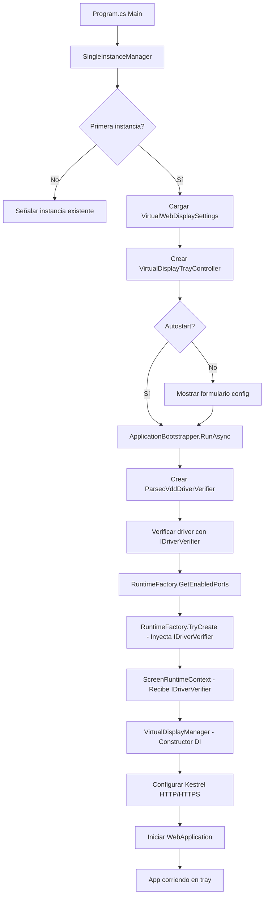

# 🤖 AGENT.md - Contexto para IA

> **Propósito**: Este archivo proporciona contexto técnico completo para asistentes de IA que modifican este proyecto.

---

## 📋 RESUMEN EJECUTIVO

### ¿Qué es VirtualWebDisplay?
Aplicación Windows que crea **pantallas virtuales** usando Parsec VDD (Virtual Display Driver) y las retransmite por **HTTP/HTTPS** usando **WebRTC** o **Web Image** (JPEG polling). Permite usar dispositivos móviles/tablets como monitores adicionales.

### Stack Tecnológico
- **.NET 10** (net10.0-windows)
- **WinForms** (UI: tray icon, formularios)
- **ASP.NET Core / Kestrel** (servidor web)
- **SIPSorcery** (WebRTC)
- **Parsec VDD** (driver de pantalla virtual - externo)
- **System.Drawing** (captura de pantalla)

### Propósito Principal
1. Crear 1-2 pantallas virtuales en Windows
2. Capturar contenido de esas pantallas
3. Retransmitir por web (HTTP/HTTPS) a navegadores
4. Soportar WebRTC (baja latencia) o Web Image (e-ink friendly)

---

## 🏗️ ARQUITECTURA DEL CÓDIGO

### Estructura de Carpetas y Responsabilidades

```
VirtualWebDisplay_Parsec/
│
├── UI/                              ← 🎨 Interfaz de Usuario
│   ├── Forms/                       
│   │   ├── ResolutionConfigurationForm.cs  ← Formulario principal de config
│   │   ├── ScreenTabControls.cs            ← Controles de cada pestaña
│   │   └── InstallDialog.cs                ← Diálogo instalación Parsec VDD
│   ├── Helpers/                     ← 🛠️ Utilidades de Vista
│   │   ├── ShellHelper.cs                 ← Apertura segura URLs/Procesos
│   │   ├── UiDispatcherHelper.cs          ← Marshaling seguro UI thread
│   │   └── WindowDragHelper.cs            ← P/Invoke arrastre de ventanas
│   ├── TrayIcon/
│   │   └── VirtualDisplayTrayController.cs ← System tray icon y menú
│   └── HtmlTemplates/
│       ├── IHtmlTemplate.cs               ← Interfaz de templates
│       ├── WebImagePageTemplate.cs        ← Template JPEG polling
│       └── RtcPageTemplate.cs             ← Template WebRTC
│
├── Configuration/                   ← ⚙️ Configuración y Modelos
│   ├── Models/
│   │   ├── VirtualScreenConfig.cs         ← Config de 1 pantalla
│   │   └── VirtualWebDisplaySettings.cs   ← Config multi-pantalla
│   ├── VirtualScreenSettingsStore.cs      ← Persistencia JSON
│   ├── VirtualDisplayProfiles.cs          ← Perfiles de resolución
│   ├── TransmissionModeOptions.cs         ← WebImage vs WebRTC
│   └── VirtualDisplayPlacementOptions.cs  ← Posición del monitor
│
├── Parsec/                          ← 📺 Driver Virtual Display
│   └── VirtualDisplayManager.cs           ← API de Parsec VDD (unsafe code)
│
├── Streaming/                       ← 📡 Captura y Retransmisión
│   ├── CaptureService.cs                  ← Captura pantalla + JPEG encode
│   ├── WebRtcStreamService.cs             ← WebRTC streaming
│   └── Models/
│       ├── WebRtcSessionOffer.cs
│       └── WebRtcSessionAnswer.cs
│
├── Infrastructure/                  ← 🔧 Servicios Base
│   ├── Drivers/                            ← 🎯 Abstracción de Drivers
│   │   ├── IDriverVerifier.cs              ← Interfaz verificación multi-driver
│   │   └── ParsecVddDriverVerifier.cs      ← Implementación Parsec VDD
│   ├── Polling/
│   │   └── PollingHelper.cs                ← Helper genérico de timeout/polling
│   ├── Messaging/
│   │   └── StartupErrorMessages.cs         ← Centralización de mensajes de error
│   ├── ApplicationBootstrapper.cs          ← Orquestador de inicio
│   ├── ApplicationLifecycleManager.cs      ← Bucle de servicio (start/stop/restart)
│   ├── ScreenRuntimeContext.cs             ← Contexto por pantalla
│   ├── RuntimeFactory.cs                   ← Factory de runtimes (usa IDriverVerifier)
│   ├── RuntimeStartupHelper.cs             ← Helper de inicio de runtimes
│   ├── RuntimeCleanupHelper.cs             ← Helper de limpieza (usa PollingHelper)
│   ├── NetworkAddressHelper.cs             ← Detección IP local
 │   ├── UsbNetworkHelper.cs                 ← Helper para detección de IP en anclaje USB
│   ├── LocalCertificateProvider.cs         ← Cert SSL autofirmado
│   ├── SingleInstanceActivator.cs          ← Mutex UI y activación de ventana (Local)
│   └── Hosting/SingleInstanceManager.cs    ← Mutex ciclo de vida del servicio (Local)
│
└── Program.cs                       ← 🚀 Entry Point (usa ApplicationBootstrapper)
```

### Namespaces

| Carpeta | Namespace |
|---------|-----------|
| `UI/Forms/` | `VirtualWebDisplay.UI.Forms` |
| `UI/Helpers/` | `VirtualWebDisplay.UI.Helpers` |
| `UI/Messaging/` | `VirtualWebDisplay.UI.Messaging` |
| `UI/Theme/` | `VirtualWebDisplay.UI.Theme` |
| `UI/TrayIcon/` | `VirtualWebDisplay.UI.TrayIcon` |
| `Web/Api/` | `VirtualWebDisplay.Web.Api` |
| `Web/Handlers/` | `VirtualWebDisplay.Web.Handlers` |
| `Web/Hosting/` | `VirtualWebDisplay.Web.Hosting` |
| `Web/HtmlTemplates/` | `VirtualWebDisplay.Web.HtmlTemplates` |
| `Web/Security/` | `VirtualWebDisplay.Web.Security` |
| `Configuration/Models/` | `VirtualWebDisplay.Configuration.Models` |
| `Configuration/` | `VirtualWebDisplay.Configuration` |
| `Parsec/` | `VirtualWebDisplay.Parsec` |
| `Streaming/` | `VirtualWebDisplay.Streaming` |
| `Streaming/Models/` | `VirtualWebDisplay.Streaming.Models` |
| `Infrastructure/*/` | `VirtualWebDisplay.Infrastructure.*` |

---

## 🔄 FLUJOS CRÍTICOS

### 1. Inicio de Aplicación (con Dependency Injection)



### 2. Creación de Pantalla Virtual

```
VirtualDisplayManager.TryCreate()
  ├─ 1. Abrir handle al driver Parsec VDD (unsafe P/Invoke)
  ├─ 2. AddDisplay() → Crear monitor virtual
  ├─ 3. Detectar nuevo Screen en Screen.AllScreens
  ├─ 4. ArrangeVirtualDisplay() → Configurar posición/resolución
  ├─ 5. ChangeDisplaySettingsEx() → Aplicar configuración Windows
  └─ 6. Retornar índice de monitor en Screen.AllScreens
```

### 3. Streaming de Contenido

**WebImage Mode (JPEG Polling)**:
```
Browser GET / → WebImagePageTemplate
Browser polling GET /cap cada X ms
  ├─ CaptureService.GetCurrentFrame()
  │   ├─ Graphics.CopyFromScreen()
  │   ├─ Rotar si es necesario
  │   ├─ Encode JPEG (EncoderParameter Quality)
  │   └─ Cache en memoria
  └─ Return JPEG bytes
```

**WebRTC Mode**:
```
Browser GET / → RtcPageTemplate
Browser POST /webrtc/offer con SDP
  ├─ WebRtcStreamService.CreateAnswerAsync()
  │   ├─ Crear RTCPeerConnection
  │   ├─ Crear DataChannel "frames"
  │   ├─ ICE gathering
  │   └─ Return SDP answer
  ├─ Background loop:
  │   ├─ CaptureService.GetCurrentFrame()
  │   ├─ Split en chunks de 64KB
  │   ├─ DataChannel.send(metadata + chunks)
  │   └─ Browser ensambla frame
  └─ Canvas renderiza JPEG
```

---

## 🎯 COMPONENTES PRINCIPALES

### Program.cs (Entry Point)
**Responsabilidades**:
- Verificar instancia única (`SingleInstanceManager`)
- Cargar configuración (`VirtualScreenSettingsStore`)
- Crear tray controller (`VirtualDisplayTrayController`)
- Verificar Parsec VDD si es necesario
- Crear runtimes por pantalla (`ScreenRuntimeContext`)
- Configurar Kestrel (HTTP + HTTPS con cert autofirmado)
- Mapear endpoints: `/`, `/auth/login`, `/cap`, `/webrtc/offer`, `/mjpeg`, `/cert`, `/config`
- Cleanup al cerrar

**Endpoints HTTP**:
- `GET /` → Template HTML (WebImage o RTC según config); si seguridad activa y no autenticado, devuelve login por clave
- `POST /auth/login` → Login por clave de pantalla (cookie HTTP-only)
- `GET /cap` → JPEG frame actual (requiere auth si seguridad activa)
- `POST /webrtc/offer` → Negociación WebRTC (requiere auth si seguridad activa)
- `GET /mjpeg` → MJPEG stream (legacy, requiere auth si seguridad activa)
- `GET /cert` → Descargar certificado SSL (.crt)
- `GET /config` → JSON con configuración actual (requiere auth si seguridad activa)

### VirtualDisplayTrayController
**Responsabilidades**:
- Crear NotifyIcon en system tray
- Menú contextual (Configuración, Abrir, Reiniciar, Salir)
- Mostrar formulario de configuración
- Thread STA para WinForms
- Gestionar ciclo de vida UI

**⚠️ Importante**: Corre en thread separado STA (WinForms requirement)

### VirtualDisplayManager
**Responsabilidades**:
- Interfaz con driver de display virtual (a través de IDriverVerifier)
- Crear/destruir monitores virtuales
- Configurar resolución y posición
- Keep-alive del driver (Update cada 100ms)

**⚠️ IMPORTANTE**: 
- **Ya NO usa métodos estáticos** (refactorizado a DI)
- Constructor recibe `IDriverVerifier` para desacoplamiento
- Usa `ParsecVddDriverApi` compartida (P/Invoke bajo nivel)

**Métodos clave**:
- `TryCreate(config)` → Crear monitor virtual (usa _driverVerifier.Verify() en fallback)
- `TryReconfigure(config)` → Cambiar resolución/posición
- `Dispose()` → Eliminar monitor virtual

### IDriverVerifier (Abstracción de Drivers) 🆕
**Responsabilidades**:
- Abstracción para verificar disponibilidad de drivers de display virtual
- Permite soporte multi-plataforma (Parsec VDD, futuro Linux/macOS)
- Desacopla verificación de implementación concreta

**Implementaciones**:
- `ParsecVddDriverVerifier` → Parsec VDD (Windows)
- Futuro: `LinuxVirtualDisplayDriverVerifier`, `MacOSVirtualDisplayDriverVerifier`

**Métodos de interfaz**:
```csharp
public interface IDriverVerifier
{
    (bool isAvailable, string statusMessage) Verify();
    string InstallUrl { get; }
    string DriverName { get; }
}
```

**Cadena de DI completa**:
```
ApplicationBootstrapper 
  └─> new ParsecVddDriverVerifier()
      └─> RuntimeFactory.GetEnabledPorts(driverVerifier)
          └─> RuntimeFactory.TryCreate(..., driverVerifier)
              └─> ScreenRuntimeContext(..., driverVerifier)
                  └─> VirtualDisplayManager(driverVerifier)
```

### ParsecVddDriverApi (P/Invoke Compartida) 🆕
**Responsabilidades**:
- API de bajo nivel P/Invoke para comunicación con driver Parsec VDD
- Compartida entre `VirtualDisplayManager` y `ParsecVddDriverVerifier`
- Encapsula llamadas a Win32 (setupapi.dll, kernel32.dll)

**⚠️ CRÍTICO**: Contiene `unsafe` code. Modificar con extremo cuidado.

**Métodos clave**:
- `OpenHandle(guid)` → Abrir handle al driver
- `CloseHandle(handle)` → Cerrar handle
- `AddDisplay(handle, out index)` → Crear monitor virtual
- `RemoveDisplay(handle, index)` → Eliminar monitor
- `Update(handle)` → Keep-alive del driver
- `IsValidHandle(handle)` → Validar handle

### ApplicationBootstrapper 🆕
**Responsabilidades**:
- Orquestador de inicio de aplicación
- Crea `IDriverVerifier` (single point of instantiation)
- Verifica driver antes de crear servidor
- Delega ciclo de vida a `ApplicationLifecycleManager`

**Flujo**:
1. Crear `ParsecVddDriverVerifier`
2. Verificar driver con `RuntimeFactory.GetEnabledPorts`
3. Delegar a `ApplicationLifecycleManager.RunServiceLoopAsync`

### ApplicationLifecycleManager (Refactorizado) 🆕
**Responsabilidades**:
- Bucle principal de inicio/parada/restart del servicio
- Coordinación con tray icon
- Limpieza de recursos al salir

**Métodos**:
- `RunServiceLoopAsync()` → Bucle principal (antes era `RunAsync`)
- Recibe `IDriverVerifier` y `enabledPorts` para evitar verificaciones duplicadas

### PollingHelper (Helper Genérico) 🆕
**Responsabilidades**:
- Helper genérico para polling con timeout
- Elimina duplicación de lógica "esperar hasta condición o timeout"
- Versiones síncronas y asíncronas

**Métodos**:
- `WaitUntilAsync(condition, timeout, pollInterval)` → Async
- `WaitUntil(condition, timeout, pollInterval)` → Sync

**Uso en el proyecto**:
- `VirtualDisplayManager.TryCreate()` → Espera detección de monitor virtual
- `RuntimeCleanupHelper.WaitForVirtualDisplaysRemovalAsync()` → Espera remoción de displays

### StartupErrorMessages (Centralización) 🆕
**Responsabilidades**:
- Centraliza construcción de mensajes de error durante inicio
- Elimina duplicación del patrón "mensaje + \\n\\n + sufijo"

**Métodos**:
- `ForDriverUnavailable(driverStatus)` → Error driver no disponible
- `ForDisplayCreationFailure(displayStatus)` → Error creación display
- `ForMonitorNotDetected(displayStatus, screenName)` → Monitor no detectado
- `TitleForDisplayError(displayName)` → Título error de display
- `TitleForDriverMissing()` → Título driver faltante
- `TryReconfigure(config)` → Cambiar resolución/posición
- `Dispose()` → Eliminar monitor virtual

### CaptureService
**Responsabilidades**:
- Background service (`BackgroundService`)
- Capturar pantalla usando `Graphics.CopyFromScreen()`
- Dibujar cursor si está visible
- Rotar imagen si es necesario
- Encode a JPEG con calidad configurable
- Cache último frame en memoria
- Change detection (hash sampling) para evitar encodes innecesarios

**Optimizaciones**:
- Usa `ImageCodecInfo` cached
- Sampling hash (cada 8vo pixel) para detectar cambios
- Skip encode si frame idéntico

### WebRtcStreamService
**Responsabilidades**:
- Background service para WebRTC
- Gestionar múltiples peers (Dictionary concurrente)
- Crear offers/answers SDP
- DataChannel "frames" con `ordered: false, maxRetransmits: 0`
- Chunking de frames JPEG (64KB chunks)
- Metadata JSON + binary chunks

**⚠️ DELICADO**: WebRTC es sensible. Usa SIPSorcery. Modificar con cuidado.

### ScreenRuntimeContext
**Responsabilidades**:
- Contenedor de servicios por pantalla
- Agrupa: Config, DisplayManager, CaptureService, WebRtcStreamService
- Gestiona lifecycle (Start/Stop/Dispose)

**Patrón**: Un runtime por pantalla virtual

### VirtualScreenSettingsStore
**Responsabilidades**:
- Persistir/cargar `VirtualWebDisplaySettings` en JSON
- Ubicación: `%USERPROFILE%\.virtualwebdisplay\virtualscreen.user.json`
- Migración de configs antiguas
- Archivos ocultos en Windows

**⚠️ Persistencia**: Los cambios se guardan al aplicar config en el formulario

---

## 🛡️ REGLAS DE MODIFICACIÓN

### 1. Namespaces
**SIEMPRE** usar el namespace según la carpeta:
```csharp
namespace VirtualWebDisplay.[Carpeta].[Subcarpeta];
```

### 2. Nuevos Archivos - Ubicación según Responsabilidad

| Si es... | Crear en... |
|----------|-------------|
| Formulario/Dialog | `UI/Forms/` |
| Template HTML | `UI/HtmlTemplates/` |
| Modelo de datos | `Configuration/Models/` |
| Lógica de config | `Configuration/` |
| Streaming/Captura | `Streaming/` |
| Servicio base | `Infrastructure/` |
| Abstracción de driver | `Infrastructure/Drivers/` |
| Helper genérico | `Infrastructure/Polling/` o `Infrastructure/Messaging/` |
| Parsec VDD P/Invoke | `Parsec/` |

### 3. Dependencias - Qué puede importar qué

✅ **Permitido**:
- `UI/` → puede usar `Configuration`, `Infrastructure`
- `Streaming/` → puede usar `Configuration`
- `Infrastructure/` → puede usar `Configuration`, `Parsec`, `Streaming`
- `Infrastructure/Drivers/` → puede usar `Parsec` (solo ParsecVddDriverApi)
- `Parsec/` → NO debe importar `Infrastructure` (excepto `Infrastructure.Drivers`)
- `Program.cs` → puede usar TODO

❌ **Evitar**:
- Referencias circulares
- `Configuration/` importando `UI/`
- `Parsec/` importando `Streaming/` o `UI/`
- Usar `VirtualDisplayManager` directamente desde UI (usar `IDriverVerifier`)

### 4. Patrones y Convenciones

**Records para DTOs**:
```csharp
public sealed record WebRtcSessionOffer(string Sdp, string Type);
```

**Métodos estáticos para helpers**:
```csharp
public static class NetworkAddressHelper
{
    public static string DetectLocalIp() => ...
}
```

**Async/await para operaciones largas**:
```csharp
public async Task StartAsync(CancellationToken cancellationToken)
```

**IDisposable/IAsyncDisposable para recursos**:
```csharp
public sealed class ScreenRuntimeContext : IAsyncDisposable, IDisposable
```

**BackgroundService para workers**:
```csharp
public sealed class CaptureService : BackgroundService
{
    protected override async Task ExecuteAsync(CancellationToken stoppingToken)
}
```

### 5. Nombrado

- **Clases**: `PascalCase`
- **Métodos**: `PascalCase`
- **Campos privados**: `_camelCase`
- **Propiedades**: `PascalCase`
- **Parámetros**: `camelCase`
- **Constantes**: `PascalCase` o `UPPER_CASE`

### 6. Documentación

**Agregar XML docs** para:
- APIs públicas
- Métodos complejos
- Clases principales

```csharp
/// <summary>
/// Captures the screen and encodes to JPEG in background.
/// </summary>
public sealed class CaptureService : BackgroundService
```

---

## ⚙️ CONFIGURACIÓN

### Archivo de Configuración
- **Ubicación**: `%USERPROFILE%\.virtualwebdisplay\virtualscreen.user.json`
- **Modelo**: `VirtualWebDisplaySettings`
- **Persistencia**: `VirtualScreenSettingsStore`

### Estructura JSON
```json
{
  "Screen1": {
    "Enabled": true,
    "Port": 8000,
    "NetworkMode": "WiFi",
    "Width": 1080,
    "Height": 1920,
    "TransmissionMethod": "Rtc",
    "CaptureIntervalSeconds": 0.25,
    "JpegQuality": 40,
    "StreamRotationDegrees": 0,
    "VirtualDisplayPlacement": "right",
    "BrowserImageFit": "contain"
  },
  "Screen2": {
    "Enabled": false,
    "Port": 8002,
    ...
  }
}
```

### Campos Clave

| Campo | Tipo | Descripción |
|-------|------|-------------|
| `Enabled` | bool | Si la pantalla está activa |
| `Port` | int | Puerto HTTP (HTTPS = Port+1) |
| `Width/Height` | int | Resolución virtual |
| `TransmissionMethod` | string | "WebImage" o "Rtc" |
| `CaptureIntervalSeconds` | double | Intervalo captura (0.003-60) |
| `JpegQuality` | int | Calidad JPEG (10-100) |
| `StreamRotationDegrees` | int | Rotación (0, 90, 180, 270) |
| `VirtualDisplayPlacement` | string | "right", "left", "top", "bottom", "duplicate" |
| `BrowserImageFit` | string | "contain", "cover", "fill" |
| `ScreenSecurityEnabled` | bool | Activa clave de acceso por pantalla |
| `MonitorIndex` | int | Índice en Screen.AllScreens (-1 = auto) |
| `NetworkMode` | string | "WiFi" o "USB". USB deshabilita seguridad y limita a 1 viewer. |
| `TouchInputEnabled` | bool | Activa/desactiva entrada táctil por pantalla |
| `TouchPreserveCursor` | bool | Preserva cursor al tocar - false por defecto |
| `TouchZoomEnabled` | bool | Habilita gesto de zoom (pellizco) - true por defecto |
| `TouchZoomDelayMs` | int | Delay en ms para activar zoom (50ms por defecto) |
| `TouchHoldEnabled` | bool | Habilita mantener toque para arrastrar - true por defecto |
| `TouchHoldDelayMs` | int | Delay en ms para activar arrastre (250ms por defecto) |
| `TouchScrollEnabled` | bool | Habilita scroll con dos dedos - true por defecto |
| `TouchScrollDelayMs` | int | Delay en ms para activar scroll (250ms por defecto) |

---

## 🎮 ENTRADA TÁCTIL

### Arquitectura General

**Flujo completo**:
```
Cliente (Navegador)
  ├─ touch-input.js genera eventos tactiles (con bloqueos temporales por delay de cada gesto)
  ├─ POST /input/touch con (fingerCount, action, normalizedX/Y, deltaX/Y)
  └─ InputHandler.cs procesa eventos
      ├─ Gate: TouchInputEnabled (NoContent si false)
      ├─ Gate: Enablers granulares (ej: TouchHoldEnabled para dragstart, TouchScrollEnabled para scroll)
      ├─ Convierte coordenadas normalizadas → píxeles
      ├─ Ejecuta acción según modo (Tap, Click, Drag, Scroll)
      └─ Actualiza métricas (eventsPerSecond, avgLatencyMs)
```

### Modos Táctiles (Granulares)

En vez de modos excluyentes, los gestos se configuran granularmente:

- **TouchPreserveCursor**: Si es `true`, los taps (1/2/3 dedos) no mueven el cursor.
- **Zoom (Pellizco)**: Toggle `TouchZoomEnabled` y delay `TouchZoomDelayMs`. Escalado visual web (no mueve scroll nativo).
- **Mantener toque**: Toggle `TouchHoldEnabled` y delay `TouchHoldDelayMs`. 1 dedo hold + drag → arrastrar.
- **Scroll (Dos dedos)**: Toggle `TouchScrollEnabled` y delay `TouchScrollDelayMs`. 2 dedos hold + drag → scroll vertical/horizontal (inversión natural).

### Componentes Clave

**1. UI/Forms/ScreenTabControls.cs**:
- Master logic: El Checkbox `TouchInputEnabled` habilita/deshabilita todos los checkboxes de gestos.
- Checkboxes individuales: `TouchPreserveCursor`, `TouchZoomEnabled`, `TouchHoldEnabled`, `TouchScrollEnabled`.
- Delays granulares: `NumericUpDown` independientes que se habilitan junto con su respectivo checkbox.
- Eventos: `TouchInputChanged`, `TouchZoomChanged`, `TouchHoldChanged`, `TouchScrollChanged`, etc.
- Localización completa vía `AppText` (EN/ES).

**2. Controllers/Handlers/InputHandler.cs**:
- `ExecuteClick(type, x, y, preserveCursor)`: helper consolidado para clicks.
- `ExecuteGestureAction(action, nowMs, request)`: procesamiento centralizado de gestos.
- Gates por propiedades granulares: ignora `dragstart`/`dragmove`/`dragend` si `!TouchHoldEnabled`. Lo mismo para scroll.
- Soporta scroll horizontal y vertical simultáneo (inversión natural).

**3. wwwroot/js/touch/touch-input.js**:
- Script estático compartido para WebImage y WebRTC.
- Soporta Zoom nativo por transformaciones CSS sin envío de coordenadas.
- Delays granulares aplicados mediante timeouts de `pendingTap` y `pendingScroll`.
- Scroll invertido naturalmente (drag hacia abajo = scroll hacia abajo).

**4. Configuration/Models/VirtualScreenConfig.cs**:
- Propiedades: `TouchInputEnabled`, `TouchZoomEnabled`, `TouchZoomDelayMs`, `TouchHoldEnabled`, etc.
- Incluidas en `Clone()` y `CopyTo()` para persistencia.

**5. UI/TrayIcon/ConfigurationFormPresenter.cs**:
- Handlers como `ApplyTouchGestureChange(screenId, gesture, enabled, delay)`.
- Hot-reload: todos los cambios se aplican sin reiniciar servicio.

### Hot-Reload de Configuración Táctil

**Sin reiniciar servicio**, los cambios se aplican en vivo:
1. Usuario cambia control en UI (`ScreenTabControls`)
2. Evento emitido → `ResolutionConfigurationForm`
3. Form invoca → `ConfigurationFormPresenter`
4. Presenter actualiza → `VirtualWebDisplaySettings` (en memoria + JSON)
5. Presenter aplica → `ScreenRuntimeContext.Config` (runtime activo)
6. Próxima request a `/input/touch` (o inyección en templates si aplica) usa nueva configuración

**Controles hot-reload**:
- Checkbox "Táctil/Normal" (`TouchInputEnabled`)
- Checkboxes y Delays de Zoom, Mantener Toque y Scroll.
- Checkbox "Recordar posición del puntero".

### Endpoints Táctiles

**POST /input/touch**:
```json
// Request
{
  "fingerCount": 1,
  "action": "tap",
  "normalizedX": 0.5,
  "normalizedY": 0.5,
  "deltaX": 0,
  "deltaY": 0
}

// Response
200 OK (procesado)
204 No Content (ignorado por gate)
```

**GET /input/stats**:
```json
// Response
{
  "eventsPerSecond": 15.3,
  "avgLatencyMs": 12.5,
  "totalEvents": 4523,
  "errorCount": 2,
  "rateLimitHits": 0,
  "lastEventTimestamp": "2025-01-15T14:30:45Z"
}
```

### Scroll Natural (Inversión)

**Implementación**:
```javascript
// Cliente (TouchInputScriptHelper.cs)
const deltaX = -(currentX - lastX);  // Invertido
const deltaY = -(currentY - lastY);  // Invertido

// Backend (InputHandler.cs) traduce a scroll de Windows
MouseInputHelper.Scroll(deltaX, deltaY);
```

**Comportamiento**:
- Drag hacia **abajo** → scroll hacia **abajo**
- Drag hacia **arriba** → scroll hacia **arriba**
- Drag hacia **derecha** → scroll hacia **derecha**
- Drag hacia **izquierda** → scroll hacia **izquierda**

### Compatibilidad iPad/Safari

**Problema**: Safari tiene drag-and-drop y long-press nativos sobre imágenes.

**Solución**:
- WebImage usa `div#screen` con `background-image` (no ``)
- Prevención de eventos: `touchstart`, `touchmove`, `contextmenu`, `dragstart`, `gesturestart`
- `{ passive: false }` para permitir `preventDefault()`

### Historial de Refactoring Táctil

**Cambios recientes (commits del día)**:
1. ✅ Reemplazados 2 checkboxes contradictorios por 1 ComboBox
2. ✅ `TouchModeItem` record con 2 modos mutuamente exclusivos
3. ✅ Consolidación de eventos (6 eventos → 4 eventos)
4. ✅ Helper `ApplyScreenPropertyChange` para eliminar duplicación
5. ✅ Localización completa (AppText EN/ES) con cambio de idioma en vivo
6. ✅ Hot-reload para todos los controles táctiles
7. ✅ Master/slave logic: ComboBox controla NumericUpDown

**Principios aplicados**:
- DRY (Don't Repeat Yourself): helpers genéricos
- Mutually exclusive states: ComboBox en vez de checkboxes independientes
- Hot-reload: eventos → presenter → settings → runtime
- Localización: todos los textos vía AppText.Get()

---

## 📚 HISTORIAL DE REFACTORING RECIENTE

### Refactoring de Drivers y Arquitectura (Enero 2025) 🆕

**Objetivo**: Desacoplar verificación de drivers, aplicar SOLID, eliminar duplicación y preparar para multi-plataforma.

**Cambios implementados**:

#### Fase 1: Abstracciones Base
1. ✅ **IDriverVerifier** interface creada (`Infrastructure/Drivers/IDriverVerifier.cs`)
   - Abstracción para verificación de drivers de display virtual
   - Permite múltiples implementaciones (Parsec VDD, futuro Linux/macOS)

2. ✅ **ParsecVddDriverVerifier** implementación (`Infrastructure/Drivers/ParsecVddDriverVerifier.cs`)
   - Implementación concreta para Parsec VDD
   - Encapsula verificación sin acoplar a `VirtualDisplayManager`

3. ✅ **ParsecVddDriverApi** extracción (`Parsec/ParsecVddDriverApi.cs`)
   - Clase compartida con P/Invoke de bajo nivel
   - Usada por `VirtualDisplayManager` y `ParsecVddDriverVerifier`
   - **Eliminada** clase nested `DriverApi` (~280 líneas duplicadas)

4. ✅ **PollingHelper** creado (`Infrastructure/Polling/PollingHelper.cs`)
   - Helper genérico para polling con timeout
   - Versiones síncronas y asíncronas
   - **Eliminó duplicación** en 2 lugares diferentes

5. ✅ **StartupErrorMessages** centralización (`Infrastructure/Messaging/StartupErrorMessages.cs`)
   - Centraliza construcción de mensajes de error
   - **Eliminó patrón duplicado** en 4 lugares

#### Fase 2: Refactoring de Código Existente
1. ✅ **VirtualDisplayManager** refactorizado
   - Constructor ahora recibe `IDriverVerifier` (inyección de dependencias)
   - **Eliminado** método estático `VerifyDriverAvailability()`
   - **Eliminada** constante `InstallUrl` hardcoded
   - Usa `PollingHelper.WaitUntil()` para detección de monitor
   - **-15 líneas de código**

2. ✅ **RuntimeFactory** refactorizado
   - `GetEnabledPorts()` y `TryCreate()` reciben `IDriverVerifier`
   - Usa `StartupErrorMessages` centralizado
   - **Eliminada** dependencia directa de `VirtualDisplayManager`

3. ✅ **RuntimeStartupHelper** refactorizado
   - `StartRuntimesAsync()` recibe `IDriverVerifier`
   - Usa `StartupErrorMessages` para todos los mensajes
   - URL de instalación dinámica del `IDriverVerifier`

4. ✅ **RuntimeCleanupHelper** refactorizado
   - `WaitForVirtualDisplaysRemovalAsync()` usa `PollingHelper`
   - **-12 líneas de código**

#### Fase 3: Nueva Arquitectura de Inicio
1. ✅ **ApplicationBootstrapper** creado (`Infrastructure/ApplicationBootstrapper.cs`)
   - Orquestador de inicio de aplicación
   - **Single point of instantiation** para `ParsecVddDriverVerifier`
   - Separa concerns: bootstrap vs. lifecycle loop

2. ✅ **ApplicationLifecycleManager** refactorizado
   - Renombrado `RunAsync()` → `RunServiceLoopAsync()`
   - Recibe `IDriverVerifier` y `enabledPorts` como parámetros
   - **Eliminada** llamada duplicada a `GetEnabledPorts()` dentro del loop

3. ✅ **Program.cs** actualizado
   - Usa `ApplicationBootstrapper.RunAsync()` en vez de `ApplicationLifecycleManager`
   - Punto de entrada más limpio

#### Fase 4: Inyección de Dependencias Completa
1. ✅ **ScreenRuntimeContext** refactorizado
   - Constructor recibe `IDriverVerifier` y lo pasa a `VirtualDisplayManager`
   - Completa la cadena de DI end-to-end

2. ✅ **Cadena de DI completa**:
   ```
   ApplicationBootstrapper 
     └─> new ParsecVddDriverVerifier()
         └─> RuntimeFactory.GetEnabledPorts(driverVerifier)
             └─> RuntimeFactory.TryCreate(..., driverVerifier)
                 └─> ScreenRuntimeContext(..., driverVerifier)
                     └─> VirtualDisplayManager(driverVerifier)
   ```

**Métricas del refactoring**:
- 📊 **6 archivos nuevos** creados
- 📊 **9 archivos refactorizados**
- 📊 **~70 líneas eliminadas**
- 📊 **100% eliminación de duplicaciones** de verificación de driver
- 📊 **100% eliminación de métodos estáticos** acoplados
- 📊 **100% eliminación de constantes** hardcoded
- 📊 **Testabilidad: 100%** (fully mockeable con `IDriverVerifier`)
- 📊 **Extensibilidad multi-plataforma: Lista**

**Principios SOLID aplicados**:
- **Single Responsibility**: Cada clase con una responsabilidad única
- **Open/Closed**: `IDriverVerifier` permite extensión sin modificación
- **Liskov Substitution**: Cualquier `IDriverVerifier` es intercambiable
- **Interface Segregation**: Interfaz mínima y cohesiva
- **Dependency Inversion**: Todos los módulos dependen de abstracción

**Beneficios**:
- ✅ Código más mantenible y extensible
- ✅ Preparado para soporte multi-plataforma (Linux, macOS)
- ✅ 100% testeable con mocks
- ✅ Cero duplicación de código
- ✅ Arquitectura limpia y desacoplada

**Tracking completo**: Ver `/VirtualWebDisplay_Parsec/refactoring_PLAN.md`

### Refactoring de la Capa UI (Enero 2025) 🆕

**Objetivo**: Aplicar SOLID y DRY en la capa de presentación (WinForms), eliminando código duplicado y mejorando la seguridad entre hilos.

**Cambios implementados**:
1. ✅ **`UiDispatcherHelper`**: Centraliza `InvokeSafely` mitigando excepciones por race conditions en WinForms.
2. ✅ **`WindowDragHelper`**: Abstrae llamadas nativas P/Invoke (`user32.dll`) aislando la manipulación del SO.
3. ✅ **`ShellHelper`**: Centraliza la apertura segura de URLs y procesos, ignorando bloqueos si el SO no detecta navegadores.
4. ✅ **Limpieza Integral**: Unificación de constructores (ej: `ScreenTabControls`) y eliminación del archivo muerto `TouchInputScriptHelper.cs`.

---
- `DriverApi` (clase anidada con `unsafe`)
- `CreateFileA`, `DeviceIoControl` (Win32 API)
- Keep-alive loop (Update cada 100ms)

**Si modificas**: Testear extensivamente. Un error puede crashear el driver o Windows.

### 2. SingleInstanceManager.cs
**Por qué**: Usa `Mutex` para instancia única. Mal manejo puede dejar mutex "abandonado".

**Crítico**:
- `_mutex.ReleaseMutex()` en Dispose
- Manejo de `AbandonedMutexException`

### 4. SingleInstanceManager.cs
**Por qué**: Usa `Mutex` para instancia única. Mal manejo puede dejar mutex "abandonado".

**Crítico**:
- `_mutex.ReleaseMutex()` en Dispose
- Manejo de `AbandonedMutexException`

### 5. WebRtcStreamService.cs
**Por qué**: WebRTC es delicado. SIPSorcery tiene quirks.

**Crítico**:
- ICE gathering
- DataChannel `ordered: false, maxRetransmits: 0`
- Chunking (64KB límite)
- Frame assembly en cliente

### 4. LocalCertificateProvider.cs
**Por qué**: Genera certificado SSL autofirmado. iOS/Safari son exigentes.

### 6. LocalCertificateProvider.cs
**Por qué**: Genera certificado SSL autofirmado. iOS/Safari son exigentes.

**Crítico**:
- `ValidityDays <= 825` (límite iOS)
- SANs (Subject Alternative Names) requeridos
- Basic Constraints `certificateAuthority: true`

### 7. ApplicationBootstrapper y ApplicationLifecycleManager 🆕
**Por qué**: Orquestan el inicio completo de la aplicación.

**Crítico**:
- `ApplicationBootstrapper` es el único que instancia `ParsecVddDriverVerifier`
- `ApplicationLifecycleManager.RunServiceLoopAsync` recibe `IDriverVerifier` - NO crear nueva instancia
- Orden de llamadas: verificar driver → crear runtimes → iniciar servicios

**Si modificas**: Asegurar que la cadena de DI se mantiene completa.

---

## 📦 DEPENDENCIAS EXTERNAS

### Parsec VDD (Virtual Display Driver)
- **Qué es**: Driver de Windows que crea monitores virtuales
- **Instalación**: https://github.com/nomi-san/parsec-vdd/releases
- **Uso**: P/Invoke desde `ParsecVddDriverApi` (compartido)
- **Verificación**: `IDriverVerifier.Verify()` (abstracción) o `ParsecVddDriverVerifier` (implementación)
- **Arquitectura**: 
  - `ParsecVddDriverApi` → P/Invoke bajo nivel (unsafe)
  - `ParsecVddDriverVerifier` → Implementación de `IDriverVerifier`
  - `VirtualDisplayManager` → Gestión de lifecycle de displays

### SIPSorcery
- **NuGet**: `SIPSorcery`
- **Uso**: WebRTC (RTCPeerConnection, RTCDataChannel)
- **Docs**: https://github.com/sipsorcery/sipsorcery

### Kestrel
- **Parte de**: ASP.NET Core
- **Uso**: Servidor web HTTP/HTTPS
- **Configuración**: En `Program.cs` via `builder.WebHost.ConfigureKestrel`

---

## 🧪 TESTING Y COMPILACIÓN

### Build
```bash
dotnet build
```

### Run
```bash
dotnet run
```

### Target Framework
- **net10.0-windows** (requiere Windows)

### Verificación Manual
1. Tray icon aparece
2. Formulario de configuración funciona
3. Parsec VDD detectado
4. Monitor virtual aparece en Windows
5. HTTP en puerto configurado funciona
6. Streaming (WebImage o WebRTC) funciona

---

## 🚨 ERRORES COMUNES

### "Parsec VDD no detectado"
- **Causa**: Driver no instalado
- **Solución**: Instalar desde https://github.com/nomi-san/parsec-vdd/releases

### "Puerto en uso"
- **Causa**: Otra app usa el puerto
- **Solución**: Cambiar puerto en configuración o cerrar otra app

### "Monitor virtual no aparece"
- **Causa**: Error en `VirtualDisplayManager.TryCreate()`
- **Debug**: Ver `vddStatus` en catch

### "WebRTC no conecta"
- **Causa**: Firewall, ICE gathering fallido
- **Debug**: Consola del navegador, ver mensajes WebRTC

---

## 📝 NOTAS FINALES

### Para agregar una nueva pantalla (Screen3):
1. Agregar `Screen3` a `VirtualWebDisplaySettings`
2. Agregar pestaña en `ResolutionConfigurationForm`
3. Crear runtime en `Program.cs`
4. Ajustar puertos (Screen3.Port, Screen3.Port+1)

### Para agregar nuevo modo de streaming:
1. Crear template en `UI/HtmlTemplates/`
2. Agregar constante en `TransmissionModeOptions`
3. Agregar lógica en `Program.cs` endpoint `/`

### Para modificar UI:
- Siempre en `UI/Forms/` o `UI/TrayIcon/`
- Thread STA para WinForms
- Usar `PostToUi()` en `VirtualDisplayTrayController`

---

## 🔗 REFERENCIAS

- **Repositorio**: https://github.com/quiro90/VirtualWebDisplay
- **Documentación**:
  - `README.md` - Overview del proyecto
  - `docs/ARCHITECTURE.md` - Diseño detallado
  - `docs/DEVELOPMENT.md` - Guía de desarrollo
  - `docs/FEATURES.md` - Funcionalidades
  - `docs/CONFIGURATION.md` - Configuración avanzada

---

**Última actualización**: 2025-01-15  
**Versión del proyecto**: 1.0.0 (Post-Refactorización Táctil)  
**Cambios recientes**: Arquitectura táctil completa (Tap only vs Gestures, hot-reload, localización)
