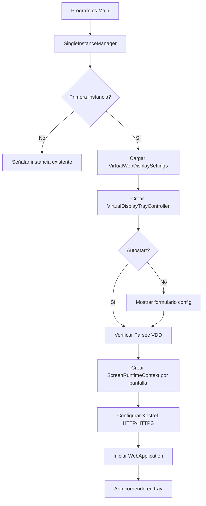

# 🤖 AGENT.md - Contexto para IA

> **Propósito**: Este archivo proporciona contexto técnico completo para asistentes de IA que modifican este proyecto.

---

## 📋 RESUMEN EJECUTIVO

### ¿Qué es VirtualWebDisplay?
Aplicación Windows que crea **pantallas virtuales** usando Parsec VDD (Virtual Display Driver) y las retransmite por **HTTP/HTTPS** usando **WebRTC** o **Web Image** (JPEG polling). Permite usar dispositivos móviles/tablets como monitores adicionales.

### Stack Tecnológico
- **.NET 10** (net10.0-windows)
- **WinForms** (UI: tray icon, formularios)
- **ASP.NET Core / Kestrel** (servidor web)
- **SIPSorcery** (WebRTC)
- **Parsec VDD** (driver de pantalla virtual - externo)
- **System.Drawing** (captura de pantalla)

### Propósito Principal
1. Crear 1-2 pantallas virtuales en Windows
2. Capturar contenido de esas pantallas
3. Retransmitir por web (HTTP/HTTPS) a navegadores
4. Soportar WebRTC (baja latencia) o Web Image (e-ink friendly)

---

## 🏗️ ARQUITECTURA DEL CÓDIGO

### Estructura de Carpetas y Responsabilidades

```
VirtualWebDisplay_Parsec/
│
├── UI/                              ← 🎨 Interfaz de Usuario
│   ├── Forms/                       
│   │   ├── ResolutionConfigurationForm.cs  ← Formulario principal de config
│   │   ├── ScreenTabControls.cs            ← Controles de cada pestaña
│   │   └── InstallDialog.cs                ← Diálogo instalación Parsec VDD
│   ├── TrayIcon/
│   │   └── VirtualDisplayTrayController.cs ← System tray icon y menú
│   └── HtmlTemplates/
│       ├── IHtmlTemplate.cs               ← Interfaz de templates
│       ├── WebImagePageTemplate.cs        ← Template JPEG polling
│       └── RtcPageTemplate.cs             ← Template WebRTC
│
├── Configuration/                   ← ⚙️ Configuración y Modelos
│   ├── Models/
│   │   ├── VirtualScreenConfig.cs         ← Config de 1 pantalla
│   │   └── VirtualWebDisplaySettings.cs   ← Config multi-pantalla
│   ├── VirtualScreenSettingsStore.cs      ← Persistencia JSON
│   ├── VirtualDisplayProfiles.cs          ← Perfiles de resolución
│   ├── TransmissionModeOptions.cs         ← WebImage vs WebRTC
│   └── VirtualDisplayPlacementOptions.cs  ← Posición del monitor
│
├── Parsec/                          ← 📺 Driver Virtual Display
│   └── VirtualDisplayManager.cs           ← API de Parsec VDD (unsafe code)
│
├── Streaming/                       ← 📡 Captura y Retransmisión
│   ├── CaptureService.cs                  ← Captura pantalla + JPEG encode
│   ├── WebRtcStreamService.cs             ← WebRTC streaming
│   └── Models/
│       ├── WebRtcSessionOffer.cs
│       └── WebRtcSessionAnswer.cs
│
├── Infrastructure/                  ← 🔧 Servicios Base
│   ├── ScreenRuntimeContext.cs            ← Contexto por pantalla
│   ├── NetworkAddressHelper.cs            ← Detección IP local
│   ├── LocalCertificateProvider.cs        ← Cert SSL autofirmado
│   └── SingleInstanceManager.cs           ← Mutex single instance
│
└── Program.cs                       ← 🚀 Entry Point (164 líneas)
```

### Namespaces

| Carpeta | Namespace |
|---------|-----------|
| `UI/Forms/` | `VirtualWebDisplay.UI.Forms` |
| `UI/TrayIcon/` | `VirtualWebDisplay.UI.TrayIcon` |
| `UI/HtmlTemplates/` | `VirtualWebDisplay.UI.HtmlTemplates` |
| `Configuration/Models/` | `VirtualWebDisplay.Configuration.Models` |
| `Configuration/` | `VirtualWebDisplay.Configuration` |
| `Parsec/` | `VirtualWebDisplay.Parsec` |
| `Streaming/` | `VirtualWebDisplay.Streaming` |
| `Streaming/Models/` | `VirtualWebDisplay.Streaming.Models` |
| `Infrastructure/` | `VirtualWebDisplay.Infrastructure` |

---

## 🔄 FLUJOS CRÍTICOS

### 1. Inicio de Aplicación



### 2. Creación de Pantalla Virtual

```
VirtualDisplayManager.TryCreate()
  ├─ 1. Abrir handle al driver Parsec VDD (unsafe P/Invoke)
  ├─ 2. AddDisplay() → Crear monitor virtual
  ├─ 3. Detectar nuevo Screen en Screen.AllScreens
  ├─ 4. ArrangeVirtualDisplay() → Configurar posición/resolución
  ├─ 5. ChangeDisplaySettingsEx() → Aplicar configuración Windows
  └─ 6. Retornar índice de monitor en Screen.AllScreens
```

### 3. Streaming de Contenido

**WebImage Mode (JPEG Polling)**:
```
Browser GET / → WebImagePageTemplate
Browser polling GET /cap cada X ms
  ├─ CaptureService.GetCurrentFrame()
  │   ├─ Graphics.CopyFromScreen()
  │   ├─ Rotar si es necesario
  │   ├─ Encode JPEG (EncoderParameter Quality)
  │   └─ Cache en memoria
  └─ Return JPEG bytes
```

**WebRTC Mode**:
```
Browser GET / → RtcPageTemplate
Browser POST /webrtc/offer con SDP
  ├─ WebRtcStreamService.CreateAnswerAsync()
  │   ├─ Crear RTCPeerConnection
  │   ├─ Crear DataChannel "frames"
  │   ├─ ICE gathering
  │   └─ Return SDP answer
  ├─ Background loop:
  │   ├─ CaptureService.GetCurrentFrame()
  │   ├─ Split en chunks de 64KB
  │   ├─ DataChannel.send(metadata + chunks)
  │   └─ Browser ensambla frame
  └─ Canvas renderiza JPEG
```

---

## 🎯 COMPONENTES PRINCIPALES

### Program.cs (Entry Point)
**Responsabilidades**:
- Verificar instancia única (`SingleInstanceManager`)
- Cargar configuración (`VirtualScreenSettingsStore`)
- Crear tray controller (`VirtualDisplayTrayController`)
- Verificar Parsec VDD si es necesario
- Crear runtimes por pantalla (`ScreenRuntimeContext`)
- Configurar Kestrel (HTTP + HTTPS con cert autofirmado)
- Mapear endpoints: `/`, `/cap`, `/webrtc/offer`, `/mjpeg`, `/cert`, `/config`
- Cleanup al cerrar

**Endpoints HTTP**:
- `GET /` → Template HTML (WebImage o RTC según config)
- `GET /cap` → JPEG frame actual
- `POST /webrtc/offer` → Negociación WebRTC
- `GET /mjpeg` → MJPEG stream (legacy)
- `GET /cert` → Descargar certificado SSL (.crt)
- `GET /config` → JSON con configuración actual

### VirtualDisplayTrayController
**Responsabilidades**:
- Crear NotifyIcon en system tray
- Menú contextual (Configuración, Abrir, Reiniciar, Salir)
- Mostrar formulario de configuración
- Thread STA para WinForms
- Gestionar ciclo de vida UI

**⚠️ Importante**: Corre en thread separado STA (WinForms requirement)

### VirtualDisplayManager
**Responsabilidades**:
- Interfaz con Parsec VDD driver (unsafe P/Invoke)
- Crear/destruir monitores virtuales
- Configurar resolución y posición
- Keep-alive del driver (Update cada 100ms)

**⚠️ CRÍTICO**: Contiene `unsafe` code y P/Invoke a driver. Modificar con extremo cuidado.

**Métodos clave**:
- `VerifyDriverAvailability()` → Check si driver está instalado
- `TryCreate(config)` → Crear monitor virtual
- `TryReconfigure(config)` → Cambiar resolución/posición
- `Dispose()` → Eliminar monitor virtual

### CaptureService
**Responsabilidades**:
- Background service (`BackgroundService`)
- Capturar pantalla usando `Graphics.CopyFromScreen()`
- Dibujar cursor si está visible
- Rotar imagen si es necesario
- Encode a JPEG con calidad configurable
- Cache último frame en memoria
- Change detection (hash sampling) para evitar encodes innecesarios

**Optimizaciones**:
- Usa `ImageCodecInfo` cached
- Sampling hash (cada 8vo pixel) para detectar cambios
- Skip encode si frame idéntico

### WebRtcStreamService
**Responsabilidades**:
- Background service para WebRTC
- Gestionar múltiples peers (Dictionary concurrente)
- Crear offers/answers SDP
- DataChannel "frames" con `ordered: false, maxRetransmits: 0`
- Chunking de frames JPEG (64KB chunks)
- Metadata JSON + binary chunks

**⚠️ DELICADO**: WebRTC es sensible. Usa SIPSorcery. Modificar con cuidado.

### ScreenRuntimeContext
**Responsabilidades**:
- Contenedor de servicios por pantalla
- Agrupa: Config, DisplayManager, CaptureService, WebRtcStreamService
- Gestiona lifecycle (Start/Stop/Dispose)

**Patrón**: Un runtime por pantalla virtual

### VirtualScreenSettingsStore
**Responsabilidades**:
- Persistir/cargar `VirtualWebDisplaySettings` en JSON
- Ubicación: `%USERPROFILE%\.virtualwebdisplay\virtualscreen.user.json`
- Migración de configs antiguas
- Archivos ocultos en Windows

**⚠️ Persistencia**: Los cambios se guardan al aplicar config en el formulario

---

## 🛡️ REGLAS DE MODIFICACIÓN

### 1. Namespaces
**SIEMPRE** usar el namespace según la carpeta:
```csharp
namespace VirtualWebDisplay.[Carpeta].[Subcarpeta];
```

### 2. Nuevos Archivos - Ubicación según Responsabilidad

| Si es... | Crear en... |
|----------|-------------|
| Formulario/Dialog | `UI/Forms/` |
| Template HTML | `UI/HtmlTemplates/` |
| Modelo de datos | `Configuration/Models/` |
| Lógica de config | `Configuration/` |
| Streaming/Captura | `Streaming/` |
| Servicio base | `Infrastructure/` |
| Parsec VDD | `Parsec/` |

### 3. Dependencias - Qué puede importar qué

✅ **Permitido**:
- `UI/` → puede usar `Configuration`, `Infrastructure`
- `Streaming/` → puede usar `Configuration`
- `Infrastructure/` → puede usar `Configuration`, `Parsec`, `Streaming`
- `Program.cs` → puede usar TODO

❌ **Evitar**:
- Referencias circulares
- `Configuration/` importando `UI/`
- `Parsec/` importando `Streaming/`

### 4. Patrones y Convenciones

**Records para DTOs**:
```csharp
public sealed record WebRtcSessionOffer(string Sdp, string Type);
```

**Métodos estáticos para helpers**:
```csharp
public static class NetworkAddressHelper
{
    public static string DetectLocalIp() => ...
}
```

**Async/await para operaciones largas**:
```csharp
public async Task StartAsync(CancellationToken cancellationToken)
```

**IDisposable/IAsyncDisposable para recursos**:
```csharp
public sealed class ScreenRuntimeContext : IAsyncDisposable, IDisposable
```

**BackgroundService para workers**:
```csharp
public sealed class CaptureService : BackgroundService
{
    protected override async Task ExecuteAsync(CancellationToken stoppingToken)
}
```

### 5. Nombrado

- **Clases**: `PascalCase`
- **Métodos**: `PascalCase`
- **Campos privados**: `_camelCase`
- **Propiedades**: `PascalCase`
- **Parámetros**: `camelCase`
- **Constantes**: `PascalCase` o `UPPER_CASE`

### 6. Documentación

**Agregar XML docs** para:
- APIs públicas
- Métodos complejos
- Clases principales

```csharp
/// <summary>
/// Captures the screen and encodes to JPEG in background.
/// </summary>
public sealed class CaptureService : BackgroundService
```

---

## ⚙️ CONFIGURACIÓN

### Archivo de Configuración
- **Ubicación**: `%USERPROFILE%\.virtualwebdisplay\virtualscreen.user.json`
- **Modelo**: `VirtualWebDisplaySettings`
- **Persistencia**: `VirtualScreenSettingsStore`

### Estructura JSON
```json
{
  "Screen1": {
    "Enabled": true,
    "Port": 8000,
    "Width": 1080,
    "Height": 1920,
    "TransmissionMethod": "Rtc",
    "CaptureIntervalSeconds": 0.25,
    "JpegQuality": 40,
    "StreamRotationDegrees": 0,
    "VirtualDisplayPlacement": "right",
    "BrowserImageFit": "contain"
  },
  "Screen2": {
    "Enabled": false,
    "Port": 8002,
    ...
  }
}
```

### Campos Clave

| Campo | Tipo | Descripción |
|-------|------|-------------|
| `Enabled` | bool | Si la pantalla está activa |
| `Port` | int | Puerto HTTP (HTTPS = Port+1) |
| `Width/Height` | int | Resolución virtual |
| `TransmissionMethod` | string | "WebImage" o "Rtc" |
| `CaptureIntervalSeconds` | double | Intervalo captura (0.003-60) |
| `JpegQuality` | int | Calidad JPEG (10-100) |
| `StreamRotationDegrees` | int | Rotación (0, 90, 180, 270) |
| `VirtualDisplayPlacement` | string | "right", "left", "top", "bottom", "duplicate" |
| `BrowserImageFit` | string | "contain", "cover", "fill" |
| `MonitorIndex` | int | Índice en Screen.AllScreens (-1 = auto) |

---

## 🔥 ÁREAS SENSIBLES (Modificar con Cuidado)

### 1. VirtualDisplayManager.cs
**Por qué**: Usa `unsafe` code y P/Invoke al driver Parsec VDD.

**Funciones críticas**:
- `DriverApi` (clase anidada con `unsafe`)
- `CreateFileA`, `DeviceIoControl` (Win32 API)
- Keep-alive loop (Update cada 100ms)

**Si modificas**: Testear extensivamente. Un error puede crashear el driver o Windows.

### 2. SingleInstanceManager.cs
**Por qué**: Usa `Mutex` para instancia única. Mal manejo puede dejar mutex "abandonado".

**Crítico**:
- `_mutex.ReleaseMutex()` en Dispose
- Manejo de `AbandonedMutexException`

### 3. WebRtcStreamService.cs
**Por qué**: WebRTC es delicado. SIPSorcery tiene quirks.

**Crítico**:
- ICE gathering
- DataChannel `ordered: false, maxRetransmits: 0`
- Chunking (64KB límite)
- Frame assembly en cliente

### 4. LocalCertificateProvider.cs
**Por qué**: Genera certificado SSL autofirmado. iOS/Safari son exigentes.

**Crítico**:
- `ValidityDays <= 825` (límite iOS)
- SANs (Subject Alternative Names) requeridos
- Basic Constraints `certificateAuthority: true`

---

## 📦 DEPENDENCIAS EXTERNAS

### Parsec VDD (Virtual Display Driver)
- **Qué es**: Driver de Windows que crea monitores virtuales
- **Instalación**: https://parsec.app/downloads
- **Uso**: P/Invoke desde `VirtualDisplayManager`
- **Verificación**: `VirtualDisplayManager.VerifyDriverAvailability()`

### SIPSorcery
- **NuGet**: `SIPSorcery`
- **Uso**: WebRTC (RTCPeerConnection, RTCDataChannel)
- **Docs**: https://github.com/sipsorcery/sipsorcery

### Kestrel
- **Parte de**: ASP.NET Core
- **Uso**: Servidor web HTTP/HTTPS
- **Configuración**: En `Program.cs` via `builder.WebHost.ConfigureKestrel`

---

## 🧪 TESTING Y COMPILACIÓN

### Build
```bash
dotnet build
```

### Run
```bash
dotnet run
```

### Target Framework
- **net10.0-windows** (requiere Windows)

### Verificación Manual
1. Tray icon aparece
2. Formulario de configuración funciona
3. Parsec VDD detectado
4. Monitor virtual aparece en Windows
5. HTTP en puerto configurado funciona
6. Streaming (WebImage o WebRTC) funciona

---

## 🚨 ERRORES COMUNES

### "Parsec VDD no detectado"
- **Causa**: Driver no instalado
- **Solución**: Instalar desde https://parsec.app/downloads

### "Puerto en uso"
- **Causa**: Otra app usa el puerto
- **Solución**: Cambiar puerto en configuración o cerrar otra app

### "Monitor virtual no aparece"
- **Causa**: Error en `VirtualDisplayManager.TryCreate()`
- **Debug**: Ver `vddStatus` en catch

### "WebRTC no conecta"
- **Causa**: Firewall, ICE gathering fallido
- **Debug**: Consola del navegador, ver mensajes WebRTC

---

## 📝 NOTAS FINALES

### Para agregar una nueva pantalla (Screen3):
1. Agregar `Screen3` a `VirtualWebDisplaySettings`
2. Agregar pestaña en `ResolutionConfigurationForm`
3. Crear runtime en `Program.cs`
4. Ajustar puertos (Screen3.Port, Screen3.Port+1)

### Para agregar nuevo modo de streaming:
1. Crear template en `UI/HtmlTemplates/`
2. Agregar constante en `TransmissionModeOptions`
3. Agregar lógica en `Program.cs` endpoint `/`

### Para modificar UI:
- Siempre en `UI/Forms/` o `UI/TrayIcon/`
- Thread STA para WinForms
- Usar `PostToUi()` en `VirtualDisplayTrayController`

---

## 🔗 REFERENCIAS

- **Repositorio**: https://github.com/quiro90/VirtualWebDisplay
- **Documentación**:
  - `README.md` - Overview del proyecto
  - `ARCHITECTURE.md` - Diseño detallado
  - `DEVELOPMENT.md` - Guía de desarrollo
  - `docs/FEATURES.md` - Funcionalidades
  - `docs/CONFIGURATION.md` - Configuración avanzada

---

**Última actualización**: 2024-01-26  
**Versión del proyecto**: 1.0.0 (Post-Refactorización)
