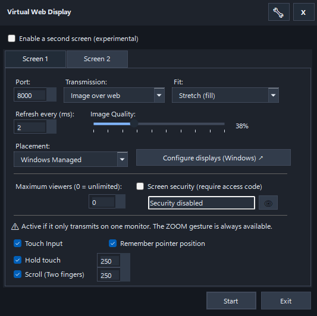

# 🖥️ VirtualWebDisplay

**Transmite pantallas virtuales de Windows a través de tu navegador web con latencia ultra-baja usando WebRTC o JPEG polling.**

[](https://dotnet.microsoft.com/download/dotnet/10.0)
[](https://www.microsoft.com/windows)
[](LICENSE)

---

## 🌟 Características

- ✨ **Pantallas Virtuales**: Crea hasta 2 monitores virtuales usando Parsec VDD driver
- 🚀 **Transmisión de Baja Latencia**: WebRTC con DataChannel optimizado (< 50ms)
- 🎨 **Doble Modo de Streaming**:
  - **Web Image**: JPEG polling (compatible con cualquier navegador)
  - **WebRTC**: Streaming en tiempo real (navegadores modernos)
- ⚙️ **Altamente Configurable**:
  - Resolución personalizada (desde **420p hasta 5K**)
  - Intervalo de captura extremo (desde **1ms hasta 300ms**)
  - Calidad JPEG ajustable (1-100)
  - Posicionamiento de pantallas (derecha, izquierda, arriba, abajo)
  - Rotación de imagen (0°, 90°, 180°, 270°)
- 🌐 **Acceso Remoto**: Accede desde cualquier dispositivo en tu red local
- 🎯 **Sin Configuración de Red**: Detección automática de IP local
- 💾 **Persistencia de Configuración**: Settings guardados en `%USERPROFILE%\.virtualwebdisplay\virtualscreen.user.json`

---

## 👆 NUEVO: Cliente Web Táctil Avanzado

El cliente web ha sido reconstruido con un soporte táctil nativo de primer nivel, permitiendo controlar Windows desde tu tablet o teléfono como si fuera una pantalla nativa:

- 🖱️ **Traducción Perfecta**: Convierte eventos táctiles en movimientos de mouse absoluto, garantizando precisión milimétrica.
- 🖐️ **Soporte Nativo de Gestos**:
  - **Tap simple**: Clic izquierdo rápido.
  - **Hold-to-drag**: Mantén pulsado para seleccionar texto, arrastrar iconos o mover ventanas.
  - **Scroll de dos dedos**: Desplazamiento natural para navegar por páginas y documentos.
  - **Pinch-to-zoom**: Acercar y alejar la interfaz web de manera fluida.
- ⚡ **Optimizaciones de Red**: Incluye un sistema robusto de Throttling configurable y Rate Limiting para evitar saturación de red al enviar miles de eventos táctiles.

---

## 🔒 Seguridad y Privacidad

- 🔐 **Seguridad por Pantalla (100% Funcional / OK)**: Autenticación dinámica e independiente por pantalla. Requiere una clave alfanumérica de 6 caracteres generada por el host.
- 🛡️ **Prevención de Fuerza Bruta**: Incluye sistema integrado de rate limiting que bloquea ataques de fuerza bruta contra el acceso web de las pantallas.
- ⚠️ **HTTPS Automático (Experimental / Work in Progress)**: Generación de certificados SSL autofirmados. *Nota: Esta funcionalidad está en desarrollo y puede requerir configuración manual o presentar advertencias de seguridad en navegadores.*

---

## 📸 Screenshots



---

## 🚀 Inicio Rápido

### Requisitos Previos

1. **Windows 10/11** (64-bit)
2. **.NET 10 SDK** ([descargar](https://dotnet.microsoft.com/download/dotnet/10.0))
3. **Parsec Virtual Display Driver** ([descargar](https://github.com/nomi-san/parsec-vdd/releases))

### Instalación

#### Opción 1: Ejecutable Precompilado (Recomendado)

1. Descargar la última release desde [Releases](https://github.com/quiro90/VirtualWebDisplay/releases)
2. Extraer el archivo ZIP
3. Ejecutar `VirtualWebDisplay_Parsec.exe`

#### Opción 2: Compilar desde Código Fuente

```powershell
# Clonar repositorio
git clone https://github.com/quiro90/VirtualWebDisplay.git
cd VirtualWebDisplay

# Compilar
dotnet build VirtualWebDisplay_Parsec.csproj --configuration Release

# Ejecutar
.\bin\Release\net10.0-windows\VirtualWebDisplay_Parsec.exe
```

### Instalación del Driver Parsec VDD

Si es la primera vez que ejecutas la aplicación:
Descargar e instala [Parsec VDD](https://github.com/nomi-san/parsec-vdd/releases/latest)
O usar el diálogo de instalación integrado al iniciar la app.

---

## 📖 Uso

### 1. Iniciar la Aplicación

Ejecutar `VirtualWebDisplay_Parsec.exe`. Aparecerá un icono en la bandeja del sistema.

### 2. Configurar Pantalla Virtual

Click derecho en el icono → **Configuration**

**Opciones Principales**:

| Opción | Descripción | Valores |
|--------|-------------|---------|
| **Resolution** | Tamaño de la pantalla virtual | Personalizable desde 420p hasta 5K |
| **Transmission Mode** | Método de streaming | Web Image (JPEG), RTC (WebRTC) |
| **HTTP Port** | Puerto del servidor web | 5000 (default), cualquier puerto disponible |
| **Capture Interval** | Milisegundos entre capturas | 1-300ms (Ej: 16ms = ~60 FPS) |
| **JPEG Quality** | Calidad de compresión | 1-100 (default: 75, mayor = mejor calidad) |
| **Position** | Posición relativa al monitor primario | Right, Left, Above, Below |
| **Rotation** | Rotación de imagen | 0°, 90°, 180°, 270° |
| **Screen Security** | Requiere clave de acceso al abrir el host | Activado/Desactivado por pantalla |

Click **Apply** para crear/actualizar la pantalla virtual.

### 3. Acceder desde Navegador

**Dispositivo Local**:
```
http://localhost:5001
```

**Desde otro dispositivo en la red**:
```
http://192.168.1.XXX:5001
```
*(La IP se muestra en la app y en systray)*

Si la seguridad de pantalla está activada para esa pantalla, primero aparecerá un formulario de acceso y solo mostrará contenido al ingresar la clave de 6 dígitos válida.
El modo de transmisión es compatible por cable USB (modo modem) y por WiFi compartido (sin router de por medio).

### 4. Certificado SSL (Experimental)

Para usar WebRTC en red local desde dispositivos externos, es posible que el navegador requiera HTTPS. Para instalar el certificado autofirmado generado (bajo tu propio riesgo debido a que es un WIP):

1. Navegar a `https://localhost:5001/cert`
2. Guardar `localhost.cer`
3. Doble click → **Instalar Certificado**
4. **Store Location**: Local Machine
5. **Certificate Store**: Trusted Root Certification Authorities
6. Reiniciar navegador

---

## 🎮 Casos de Uso

### 1. Monitor Extra para PC

Usa tu iPad, tablet Android, kindle o teléfono como segundo monitor táctil de alta definición.

### 2. Streaming de Aplicación Específica

Arrastra una aplicación a la pantalla virtual para transmitirla:

```
1. Crear pantalla virtual (Ej: 1280x720)
2. Mover ventana de aplicación a pantalla virtual (Win+Shift+→)
3. Acceder desde el navegador
```

### 3. Dashboard/Monitoring Remoto

Muestra métricas o dashboards en la pantalla virtual, accede desde cualquier dispositivo usando el modo de menor consumo:

```
Configuración Recomendada:
- Transmission Mode: Web Image
- Capture Interval: 50ms (baja CPU, ideal para dashboards estáticos)
```

---

## ⚙️ Configuración Avanzada

### Archivo de Configuración

`C:\Users\<Usuario>\.virtualwebdisplay\`

ui-preferences.user.json: Interfaz de usuario e idioma

virtualscreen.display.json: Resolución y posición de pantalla a restablecer

virtualscreen.user.json: configuración de usuario.

Ver **docs/CONFIGURATION.md** para detalles de cada campo.

---

## 🔧 Endpoints HTTP

| Endpoint | Método | Descripción |
|----------|--------|-------------|
| `/` | GET | Página principal (HTML con cliente de streaming) |
| `/webrtc/offer` | POST | Negociación WebRTC (SDP offer → answer) |
| `/auth/login` | POST | Login por clave cuando la seguridad de pantalla está activa |
| `/cert` | GET | Descargar certificado SSL autofirmado |
| `/config` | GET | Descargar configuración JSON actual (requiere auth si seguridad activa) |

---

## 📊 Comparación de Modos de Transmisión

| Característica | Web Image (JPEG) | WebRTC |
|----------------|------------------|--------|
| **Latencia** | ~0-200ms | ~0-50ms |
| **Compatibilidad** | Todos los navegadores | Navegadores modernos (Chrome, Edge, Safari) |
| **CPU Usage** | Bajo | Medio (por gestión de peers) |
| **Soporte Táctil** | ✅ Totalmente funcional | ✅ Totalmente funcional |
| **Múltiples Clientes** | ✅ Sí (polling independiente) | ✅ Sí (peers concurrentes) |
| **Requiere HTTPS** | ❌ No (funciona sobre HTTP) | ⚠️ Experimental (Requisito de navegadores) |

---

## 🛠️ Desarrollo

Ver documentación detallada:

- **[DEVELOPMENT.md](docs/DEVELOPMENT.md)**: Guía de desarrollo completa
- **[ARCHITECTURE.md](docs/ARCHITECTURE.md)**: Arquitectura del sistema y diagramas
- **[AGENT.md](AGENT.md)**: Contexto técnico para IA/asistentes

### Stack Tecnológico

- **.NET 10** (C# 13)
- **ASP.NET Core / Kestrel** (servidor web)
- **WinForms** (UI)
- **SIPSorcery** (WebRTC)
- **Parsec VDD** (driver de pantalla virtual)
- **System.Drawing** (captura de pantalla)

### Compilar

```powershell
dotnet build VirtualWebDisplay_Parsec.csproj --configuration Release
```

---

## 🐛 Troubleshooting

### Problema: "Parsec VDD Driver Not Found"

**Solución**:
1. Descargar [Parsec VDD](https://github.com/nomi-san/parsec-vdd/releases/latest)
2. Instalar como Administrador
3. Reiniciar aplicación

---

### Problema: WebRTC no conecta

**Solución**:
- Verificar que el navegador permite WebRTC en la IP especificada.
- Instalar certificado SSL (ver sección de uso) si se requiere un entorno seguro.
- Verificar que el firewall no bloquea el puerto (ej. 5001).

Ver **[docs/TROUBLESHOOTING.md](docs/TROUBLESHOOTING.md)** para la guía completa de problemas comunes.

---

## 📄 Licencia

Este proyecto está licenciado bajo la **MIT License** - ver archivo [LICENSE](LICENSE) para detalles.

---

## 🙏 Agradecimientos

- [Parsec VDD](https://github.com/nomi-san/parsec-vdd) - Excelente driver de pantalla virtual
- [SIPSorcery](https://github.com/sipsorcery-org/sipsorcery) - Implementación WebRTC para .NET
- [.NET Team](https://github.com/dotnet) - Por la plataforma .NET

---

## 📧 Contacto

- **GitHub Issues**: [Reportar un problema](https://github.com/quiro90/VirtualWebDisplay/issues)
- **Discussions**: [Hacer una pregunta](https://github.com/quiro90/VirtualWebDisplay/discussions)

---

## 🚀 Roadmap (POSIBLES)

- ✅ Soporte para H.264 hardware encoding (menor latencia, menor CPU)
- [ ] Streaming de audio
- [ ] Soporte para 3+ pantallas virtuales

## Evaluación a futuro

- [ ] Cliente desktop multiplataforma (Linux, macOS) (requiere investigación de drivers compatibles y UI nueva).
- [ ] Aplicación nativa de dispositivos para comunicación avanzada y más eficiente (no fue objetivo inicial pero podría ser util).

---

**⭐ Si este proyecto te resulta útil, considera darle una estrella en GitHub!**
