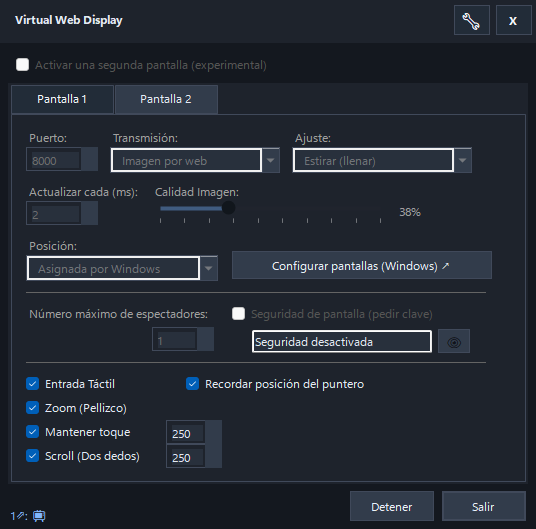
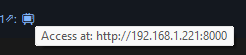

# 🖥️ VirtualWebDisplay

**Stream Windows virtual displays through your web browser with ultra-low latency using WebRTC or JPEG polling.**

[](https://dotnet.microsoft.com/download/dotnet/10.0)
[](https://www.microsoft.com/windows)
[](LICENSE)

---

## 🌟 Features

- ✨ **Virtual Displays**: Create up to 2 virtual monitors using the Parsec VDD driver  
- 🚀 **Low Latency Streaming**: WebRTC with optimized DataChannel (< 50ms)  
- 🎨 **Dual Streaming Modes**:
  - **Web Image**: JPEG polling (compatible with any browser)
  - **WebRTC**: Real-time streaming (modern browsers)
- ⚙️ **Highly Configurable**:
  - Custom resolution (from **420p up to 5K**)
  - Extreme capture interval (from **1ms to 300ms**)
  - Adjustable JPEG quality (1–100)
  - Screen positioning (right, left, above, below)
  - Image rotation (0°, 90°, 180°, 270°)
- 🌐 **Remote Access**: Access from any device on your local network  
- 🎯 **No Network Setup Required**: Automatic local IP detection  
- 💾 **Persistent Configuration**: Settings saved in `%USERPROFILE%\.virtualwebdisplay\virtualscreen.user.json`

---

## 👆 NEW: Advanced Touch Web Client

The web client has been rebuilt with first-class native touch support, allowing you to control Windows from your tablet or phone as if it were a native display:

- 🖱️ **Perfect Translation**: Converts touch events into absolute mouse movements with pixel-perfect precision  
- 🖐️ **Native Gesture Support**:
  - **Single tap**: Quick left click  
  - **Hold-to-drag**: Press and hold to select text, drag icons, or move windows  
  - **Two-finger scroll**: Natural scrolling for pages and documents  
  - **Pinch-to-zoom**: Smooth zooming of the web interface  
- ⚡ **Network Optimizations**: Includes robust configurable throttling and rate limiting to prevent network saturation when sending thousands of touch events  

---

## 🔒 Security & Privacy

- 🔐 **Per-Screen Security (100% Functional / OK)**: Dynamic and independent authentication per screen. Requires a 6-character alphanumeric key generated by the host  
- 🛡️ **Brute Force Protection**: Built-in rate limiting system to block brute force attacks on screen web access  
- ⚠️ **Automatic HTTPS (Experimental / Work in Progress)**: Self-signed SSL certificate generation  
  *Note: This feature is under development and may require manual setup or trigger browser security warnings.*  

---

## 📸 Screenshots




---

## 🚀 Quick Start

### Prerequisites

1. **Windows 10/11** (64-bit)  
2. **.NET 10 SDK** ([download](https://dotnet.microsoft.com/download/dotnet/10.0))  
3. **Parsec Virtual Display Driver** ([download](https://github.com/nomi-san/parsec-vdd/releases))  

---

### Installation

#### Option 1: Precompiled Executable (Recommended)

1. Download the latest release from [Releases](https://github.com/quiro90/VirtualWebDisplay/releases)  
2. Extract the ZIP file  
3. Run `VirtualWebDisplay_Parsec.exe`  

#### Option 2: Build from Source

```powershell
# Clone repository
git clone https://github.com/quiro90/VirtualWebDisplay.git
cd VirtualWebDisplay

# Build
dotnet build VirtualWebDisplay_Parsec.csproj --configuration Release

# Run
.\bin\Release\net10.0-windows\VirtualWebDisplay_Parsec.exe
```

### Parsec VDD Driver Installation

If this is your first time running the application:  
Download and install [Parsec VDD](https://github.com/nomi-san/parsec-vdd/releases/latest)  
Or use the integrated installer dialog when launching the app.

---

## 📖 Usage

### 1. Start the Application

Run `VirtualWebDisplay_Parsec.exe`. A system tray icon will appear.

### 2. Configure Virtual Display

Right-click the icon → **Configuration**

**Main Options**:

| Option | Description | Values |
|--------|-------------|--------|
| **Resolution** | Virtual display size | Customizable from 420p up to 5K |
| **Transmission Mode** | Streaming method | Web Image (JPEG), RTC (WebRTC) |
| **HTTP Port** | Web server port | 5000 (default), any available port |
| **Capture Interval** | Milliseconds between captures | 1–300ms (e.g. 16ms = ~60 FPS) |
| **JPEG Quality** | Compression quality | 1–100 (default: 75, higher = better quality) |
| **Position** | Relative to the primary monitor | Right, Left, Above, Below |
| **Rotation** | Image rotation | 0°, 90°, 180°, 270° |
| **Screen Security** | Requires access key when opening the host | Enabled/Disabled per screen |

Click **Apply** to create/update the virtual display.

### 3. Access via Browser

**Local Device**:
```http://localhost:5001
```

**From another device on the network**:
```http://192.168.1.XXX:5001
```

*(The IP is shown in the app and system tray)*

If screen security is enabled, an access form will appear first and content will only be shown after entering the valid 6-digit key.  
Streaming works over USB tethering (modem mode) and shared WiFi (without a router).

### 4. SSL Certificate (Experimental)

To use WebRTC on a local network from external devices, the browser may require HTTPS. To install the generated self-signed certificate (at your own risk, as this is a WIP):

1. Navigate to `https://localhost:5001/cert`  
2. Save `localhost.cer`  
3. Double click → **Install Certificate**  
4. **Store Location**: Local Machine  
5. **Certificate Store**: Trusted Root Certification Authorities  
6. Restart the browser  

---
## 🎮 Use Cases

### 1. Extra Monitor for PC

Use your iPad, Android tablet, Kindle, or phone as a high-definition touch secondary monitor.

### 2. Stream a Specific Application

Drag an application to the virtual display to stream it:

```
1. Create virtual display (e.g. 1280x720)
2. Move the application window to the virtual display (Win+Shift+→)
3. Access it from the browser
```

### 3. Remote Dashboard / Monitoring

Display metrics or dashboards on the virtual display and access them from any device using a low-resource mode:
```
Recommended Settings:

Transmission Mode: Web Image
Capture Interval: 50ms (low CPU, ideal for static dashboards)
```

---

## ⚙️ Advanced Configuration

### Configuration Files

`C:\Users\<User>\.virtualwebdisplay\`

ui-preferences.user.json: UI and language  
virtualscreen.display.json: display resolution and position to restore  
virtualscreen.user.json: user configuration  

See **docs/CONFIGURATION.md** for details on each field.

---

## 🔧 HTTP Endpoints

| Endpoint | Method | Description |
|----------|--------|-------------|
| `/` | GET | Main page (HTML with streaming client) |
| `/webrtc/offer` | POST | WebRTC negotiation (SDP offer → answer) |
| `/auth/login` | POST | Key-based login when screen security is enabled |
| `/cert` | GET | Download self-signed SSL certificate |
| `/config` | GET | Download current JSON configuration (requires auth if enabled) |

---

## 📊 Transmission Mode Comparison

| Feature | Web Image (JPEG) | WebRTC |
|--------|------------------|--------|
| **Latency** | ~0–200ms | ~0–50ms |
| **Compatibility** | All browsers | Modern browsers (Chrome, Edge, Safari) |
| **CPU Usage** | Low | Medium (peer management) |
| **Touch Support** | ✅ Fully functional | ✅ Fully functional |
| **Multiple Clients** | ✅ Yes (independent polling) | ✅ Yes (concurrent peers) |
| **Requires HTTPS** | ❌ No (works over HTTP) | ⚠️ Experimental (browser requirement) |

---

## 🛠️ Development

See detailed documentation:

- **[DEVELOPMENT.md](docs/DEVELOPMENT.md)**: Complete development guide  
- **[ARCHITECTURE.md](docs/ARCHITECTURE.md)**: System architecture and diagrams  
- **[AGENT.md](AGENT.md)**: Technical context for AI/assistants  

### Tech Stack

- **.NET 10** (C# 13)  
- **ASP.NET Core / Kestrel** (web server)  
- **WinForms** (UI)  
- **SIPSorcery** (WebRTC)  
- **Parsec VDD** (virtual display driver)  
- **System.Drawing** (screen capture)  

### Build

```powershell
dotnet build VirtualWebDisplay_Parsec.csproj --configuration Release
---

## 🐛 Troubleshooting

### Issue: "Parsec VDD Driver Not Found"

**Solution**:
1. Download [Parsec VDD](https://github.com/nomi-san/parsec-vdd/releases/latest)  
2. Install as Administrator  
3. Restart the application  

---

### Issue: WebRTC not connecting

**Solution**:
- Verify that the browser allows WebRTC for the specified IP  
- Install the SSL certificate (see usage section) if a secure context is required  
- Ensure the firewall is not blocking the port (e.g. 5001)  

See **[docs/TROUBLESHOOTING.md](docs/TROUBLESHOOTING.md)** for the complete guide to common issues.

---

## 📄 License

This project is licensed under the **MIT License** - see the [LICENSE](LICENSE) file for details.

---

## 🙏 Acknowledgements

- [Parsec VDD](https://github.com/nomi-san/parsec-vdd) - Excellent virtual display driver  
- [SIPSorcery](https://github.com/sipsorcery-org/sipsorcery) - WebRTC implementation for .NET  
- [.NET Team](https://github.com/dotnet) - For the .NET platform  

---

## 📧 Contact

- **GitHub Issues**: [Report an issue](https://github.com/quiro90/VirtualWebDisplay/issues)  
- **Discussions**: [Ask a question](https://github.com/quiro90/VirtualWebDisplay/discussions)  

---

## 🚀 Roadmap (POSSIBLE)

- [ ] H.264 hardware encoding support (lower latency, lower CPU)  
- [ ] Audio streaming  
- [ ] Support for 3+ virtual displays  

## Future Evaluation

- [ ] Cross-platform desktop client (Linux, macOS) (requires research on compatible drivers and a new UI)  
- [ ] Native device application for more advanced and efficient communication (not an initial goal, but could be useful)  

---

**⭐ If you find this project useful, consider giving it a star on GitHub!**
