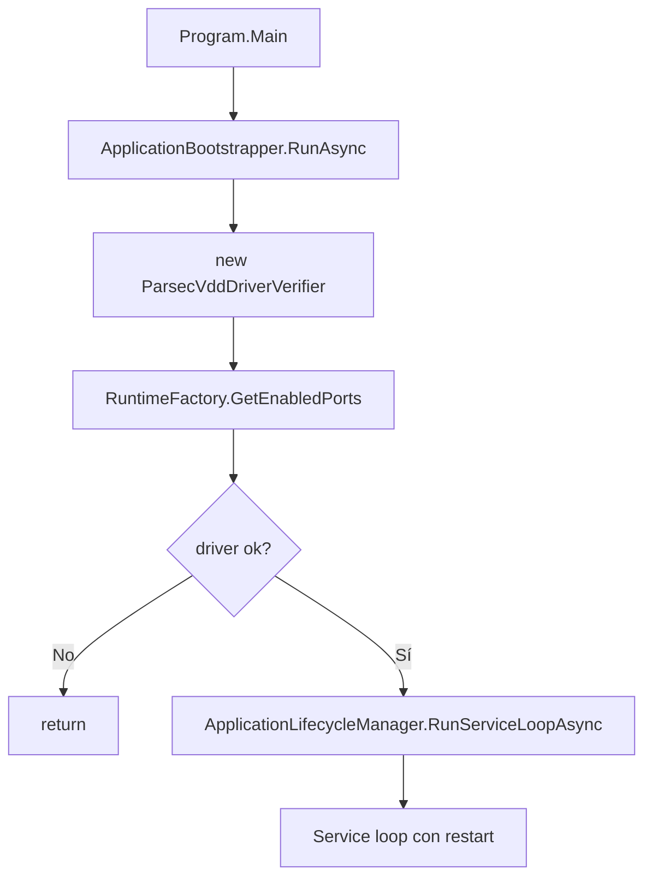

# ApplicationBootstrapper

**Namespace**: `VirtualWebDisplay.Infrastructure.Hosting`
**Archivo**: `Infrastructure/Hosting/ApplicationBootstrapper.cs` · `internal static class`.

Orquesta el inicio completo de la aplicación: verificación de driver, configuración de pantallas y preparación del servidor web. Delega el ciclo de vida del servicio a [[ApplicationLifecycleManager]].

## Responsabilidades

- **Punto único de instanciación** del `IDriverVerifier` (`new ParsecVddDriverVerifier()`).
- Verifica el driver **antes** de construir el DI container: `RuntimeFactory.GetEnabledPorts(settings, driverVerifier)`.
- Si el driver no está disponible → retorna (el usuario canceló o falta el driver).
- Delega el bucle de servicio a `ApplicationLifecycleManager.RunServiceLoopAsync(...)` (recibe `enabledPorts` y `driverVerifier` para evitar verificaciones duplicadas).
- Expone `CheckForUpdateInBackgroundAsync` para el chequeo de updates (lo invoca `Program.cs` con fire-and-forget, antes de `ShowStartupConfiguration`).

## Flujo



## Update check

`CheckForUpdateInBackgroundAsync(tray, appearanceStore)`:

- Delay de **5 s** para no interferir con el arranque visual.
- Consulta [[UpdateCheckService]].`CheckForUpdateAsync()` (GitHub Releases API, ignora prereleases).
- Si hay release nueva → muestra `UpdateAvailableDialog` (thread UI, respeta dark/light mode).
- **Falla silenciosamente**: el `catch` global evita que errores de red propaguen a la app.

> [!warning] Importante
> El chequeo de updates se dispara desde `Program.cs` **antes** de `ShowStartupConfiguration` y **fuera** del bucle de `ApplicationLifecycleManager`. No moverlo al interior del loop.

## Cadena de DI

```
ApplicationBootstrapper
  └─> new ParsecVddDriverVerifier()  (IDriverVerifier)
      └─> RuntimeFactory.GetEnabledPorts(driverVerifier)
          └─> ApplicationLifecycleManager.RunServiceLoopAsync(..., enabledPorts, driverVerifier)
              └─> RuntimeFactory.TryCreate(..., driverVerifier)
                  └─> ScreenRuntimeContext(..., driverVerifier)
                      └─> VirtualDisplayManager(driverVerifier)
```

## Enlaces

- [[ApplicationLifecycleManager]]
- [[RuntimeFactory]]
- [[IDriverVerifier (Abstracción)]]
- [[UpdateCheckService]]
- [[Arranque del Sistema]]
- [[Program (Entry Point)]]

## Continuar con
- [[ApplicationLifecycleManager]]
- [[IDriverVerifier (Abstracción)]]
