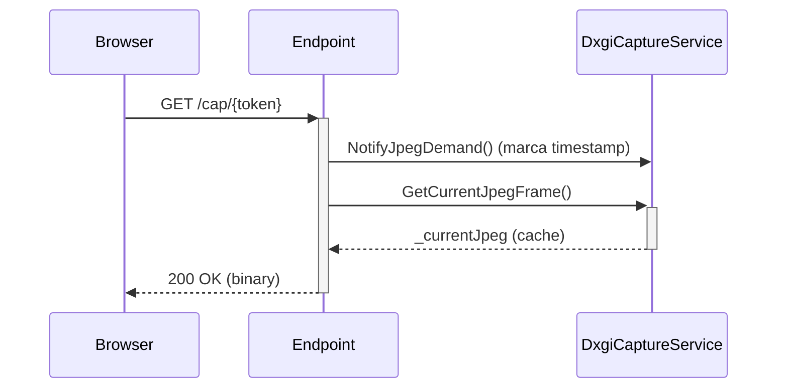
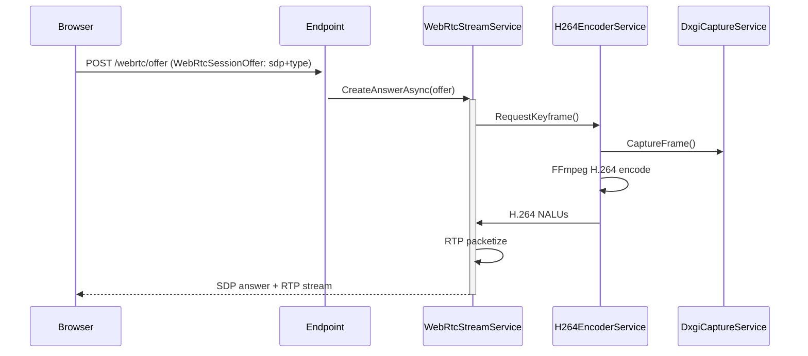

# Flujo de Captura y Streaming

Pipeline de frame → encode → stream según modo.

## WebImage (JPEG Polling)

- El loop de captura corre **continuamente** (cada `CaptureIntervalSeconds`); publica `RawFrameAvailable` siempre.
- La codificación JPEG **solo ocurre si hay demanda** (`/cap` en los últimos 2 s o consumidores `/mjpeg`), guardando el resultado en `_currentJpeg` (cache en memoria).
- `/cap/{token}` devuelve el JPEG cacheado y renueva la demanda — **no** captura sincrónica por request.
- Ver [[WebImage (JPEG Polling)]] y [[DxgiCaptureService]].

## WebRTC (H.264)

- **Keyframe on-demand** al inicio del stream.
- Encode continuo mientras hay viewers activos.
- Ver [[WebRTC (H.264)]], [[H264EncoderService]], [[WebRtcStreamService]].

## Renderizado cliente

- WebImage: `div#screen` + `background-image` ([[HTML Templates]]).
- WebRTC: `<video>` + `VideoTrack` nativo.

## Enlaces

- [[Modos de Transmisión]]
- [[DxgiCaptureService]]
- [[H264EncoderService]]
- [[WebRtcStreamService]]
- [[WebImage (JPEG Polling)]]
- [[WebRTC (H.264)]]

## Continuar con
- [[DxgiCaptureService]]
- [[H264EncoderService]]
- [[WebRtcStreamService]]
