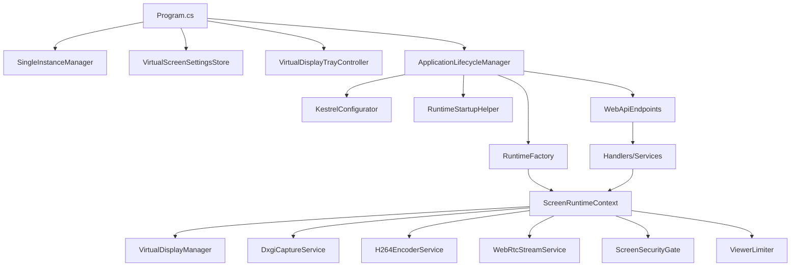
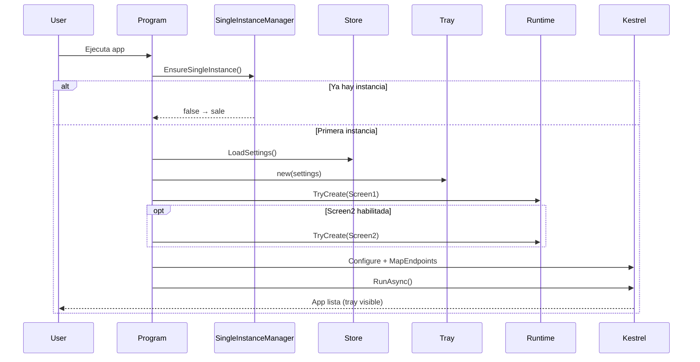
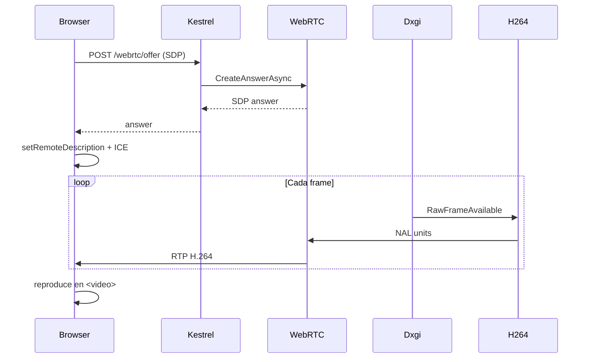

# Diagramas del Sistema

> [!note] Mermaid
> Obsidian renderiza estos diagramas nativamente.

## Arquitectura conceptual

## Arranque de la aplicación

## Captura y streaming (WebRTC)

Ver el detalle completo en [[Arranque del Sistema]], [[Flujo de Captura y Streaming]] y [[Endpoints HTTP]].

## Enlaces

- [[Arquitectura por Capas]]
- [[Resolución de Runtime por Puerto]]