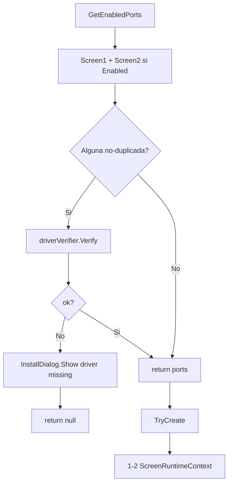

# RuntimeFactory

**Archivo**: `Infrastructure/Runtime/RuntimeFactory.cs` · `internal static class`.

Construye los [[ScreenRuntimeContext]] para cada pantalla habilitada y verifica que el driver de display virtual esté disponible si es necesario.

## Responsabilidad

- `GetEnabledPorts(settings, driverVerifier)` — devuelve los puertos habilitados tras verificar el driver. Devuelve `null` si el driver no está disponible y el usuario no puede continuar. **Llamar antes de construir el DI container** para configurar Kestrel temprano.
- `TryCreate(...)` — construye 1–2 [[ScreenRuntimeContext]] con loggers reales.

## Flujo

## Uso

- Llamado por [[ApplicationBootstrapper]] (`GetEnabledPorts`, antes de construir el DI container) y por [[ApplicationLifecycleManager]] (`TryCreate`, dentro del bucle de servicio).
- La verificación de driver se delega a [[IDriverVerifier (Abstracción)]] → `RuntimeFactory.GetEnabledPorts(driverVerifier)`.
- Los runtimes luego los arranca [[RuntimeStartupHelper]].

## Relacionados

- [[ApplicationBootstrapper]] — invoca `GetEnabledPorts` (punto único de instanciación del `IDriverVerifier`).
- [[ApplicationLifecycleManager]] — invoca `TryCreate`.
- [[ScreenRuntimeContext]] — producto de la factoría.
- [[IDriverVerifier (Abstracción)]] — verificación de driver.
- [[RuntimeStartupHelper]] — arranque posterior de los runtimes.