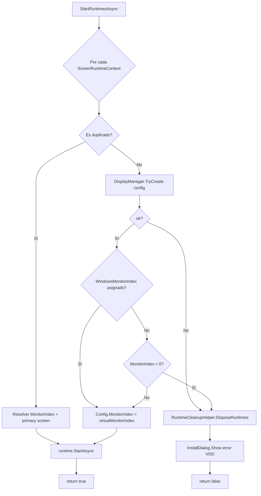

# RuntimeStartupHelper

**Archivo**: `Infrastructure/Runtime/RuntimeStartupHelper.cs` · `internal static class`.

Inicializa los runtimes de pantalla: crea los displays virtuales, asigna los índices de monitor y arranca los servicios de captura. Devuelve `false` si algún runtime no pudo iniciarse (ya muestra el diálogo de error correspondiente).

## Responsabilidad

Llamado por [[ApplicationLifecycleManager]] (`StartRuntimesAsync`):

```csharp
if (!await RuntimeStartupHelper.StartRuntimesAsync(runtimes, driverVerifier))
    // abortar arranque
```

## Flujo



## Decisiones clave

- **`MonitorIndex = -1`** significa "auto" hasta este punto: se resuelve aquí (pantalla primaria para duplicados, o el índice registrado por Windows para VDD).
- Si el VDD no se crea o el monitor no se detecta → **limpieza** vía `RuntimeCleanupHelper` + diálogo de error (`InstallDialog.Show` / `MessageBox`) y `return false`.
- Usa [[ScreenRuntimeContext]] por pantalla, [[VirtualDisplayManager]] para `TryCreate`, y `VirtualDisplayPlacementOptions.IsDuplicate` para distinguir modo duplicado.

## Relacionados

- [[ApplicationLifecycleManager]] — quien lo invoca.
- `RuntimeCleanupHelper` — limpieza de runtimes en caso de fallo (compañero simétrico).
- [[ScreenRuntimeContext]] — unidad por pantalla que arranca.
- [[VirtualDisplayManager]] — `TryCreate(config)`.
- [[IDriverVerifier (Abstracción)]] — `driverVerifier.InstallUrl` para el diálogo de instalación.