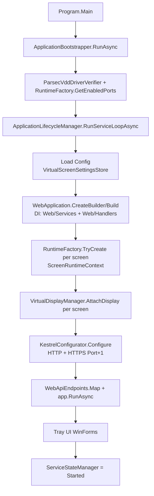

# Arranque del Sistema

Secuencia desde `Main` hasta servir HTTP.

## Diagrama

## Pasos

1. **[[Program (Entry Point)|Program.Main]]** — punto de entrada. Lanza `ApplicationBootstrapper.CheckForUpdateInBackgroundAsync` (fire-and-forget) y llama `ApplicationBootstrapper.RunAsync`.
2. **[[ApplicationBootstrapper]]** — crea el `ParsecVddDriverVerifier`, llama `RuntimeFactory.GetEnabledPorts` para verificar el driver, y delega a `ApplicationLifecycleManager.RunServiceLoopAsync`.
3. **[[ApplicationLifecycleManager]]** — orquesta el ciclo de vida del servicio.
4. **[[Configuración de Usuario|Config load]]** — `VirtualScreenSettingsStore` lee `%USERPROFILE%\.virtualwebdisplay\virtualscreen.user.json`.
5. **DI Container** — `WebApplication.CreateBuilder/Build` registra servicios (`Web/Services/`) y handlers (`Web/Handlers/`).
6. **[[ScreenRuntimeContext]]** por pantalla (vía `RuntimeFactory.TryCreate`) — agrega `VirtualDisplayManager` + `DxgiCaptureService` + `H264EncoderService` + `WebRtcStreamService` + `ScreenSecurityGate` + `ViewerLimiter`.
7. **[[VirtualDisplayManager]]** — adjunta displays Parsec VDD ([[RuntimeStartupHelper]] inicia los runtimes).
8. **Kestrel** — arranca HTTP en `Port` y HTTPS en `Port+1` ([[Certificado SSL (HTTPS)]], [[KestrelConfigurator]]).
9. **[[VirtualDisplayTrayController|Tray UI]]** — icono en bandeja, menú contextual.
10. **[[ServiceStateManager]]** — transición `Starting → Started`.

## Apagado

- `ApplicationLifetime.ApplicationStopping` → `ServiceStateManager = Stopping` → detiene Kestrel → libera displays → `Stopped`.

## Enlaces

- [[ApplicationBootstrapper]]
- [[ApplicationLifecycleManager]]
- [[Program (Entry Point)]]
- [[ServiceStateManager]]
- [[ScreenRuntimeContext]]
- [[Creación de Pantalla Virtual]]