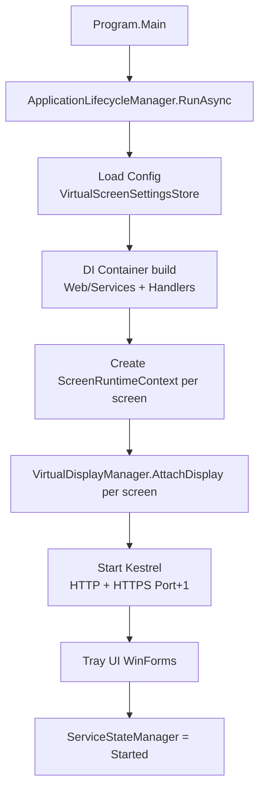

# Arranque del Sistema

Secuencia desde `Main` hasta servir HTTP.

## Diagrama

## Pasos

1. **[[Program (Entry Point)|Program.Main]]** — punto de entrada, llama `RunAsync`.
2. **[[ApplicationLifecycleManager]]** — orquesta el ciclo de vida.
3. **[[Configuración de Usuario|Config load]]** — `VirtualScreenSettingsStore` lee `%USERPROFILE%\.virtualwebdisplay\virtualscreen.user.json`.
4. **DI Container** — registra servicios (`Web/Services/`) y handlers (`Web/handlers/`).
5. **[[ScreenRuntimeContext]]** por pantalla — agrega `VirtualDisplayManager` + `DxgiCaptureService` + `H264EncoderService` + `WebRtcStreamService` + `ScreenSecurityGate` + `ViewerLimiter`.
6. **[[VirtualDisplayManager]]** — adjunta displays Parsec VDD.
7. **Kestrel** — arranca HTTP en `HttpPort` y HTTPS en `HttpPort+1` ([[Certificado SSL (HTTPS)]]).
8. **[[VirtualDisplayTrayController|Tray UI]]** — icono en bandeja, menú contextual.
9. **[[ServiceStateManager]]** — transición `Starting → Started`.

## Apagado

- `ApplicationLifetime.ApplicationStopping` → `ServiceStateManager = Stopping` → detiene Kestrel → libera displays → `Stopped`.

## Enlaces

- [[ApplicationLifecycleManager]]
- [[Program (Entry Point)]]
- [[ServiceStateManager]]
- [[ScreenRuntimeContext]]
- [[Creación de Pantalla Virtual]]