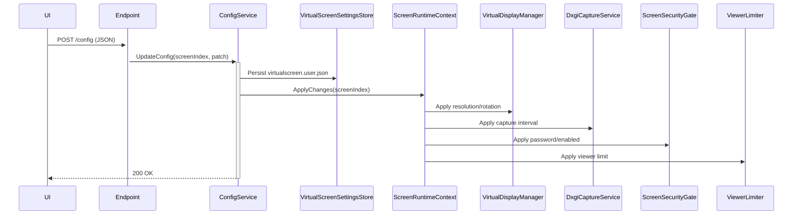

# Cambio de Configuración en Runtime

Las pantallas virtuales soportan **hot-reload** de configuración sin reiniciar el servicio.

## Flujo

## Cambios aplicables en caliente

- [[Perfiles de Resolución|Resolución]] y rotación.
- [[Modos de Transmisión|Modo de transmisión]] (WebImage ↔ RTC).
- [[Seguridad por Pantalla|Seguridad]] (password, enable/disable).
- [[Límite de Viewers|Viewer limit]].
- [[Entrada Táctil|Touch]] — todos los enablers y delays granulares.
- `CaptureIntervalMs` (WebImage polling).

## Persistencia

`VirtualScreenSettingsStore` escribe **síncrono** a `%USERPROFILE%\.virtualwebdisplay\virtualscreen.user.json`. Ver [[Configuración de Usuario]].

## Legacy field names

> [!warning] Nombres legacy
> `HttpPort`, `TransmissionMode`, `CaptureIntervalMs` son nombres legacy que siguen funcionando por compatibilidad.

## Enlaces

- [[Configuración de Usuario]]
- [[VirtualScreenConfig (Campos)]]
- [[ScreenRuntimeContext]]
- [[Endpoints HTTP]]