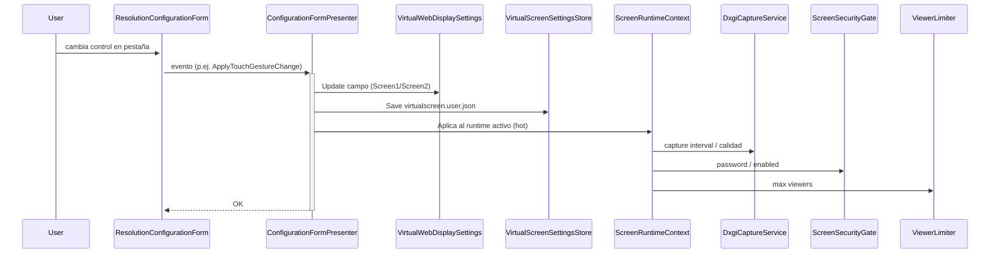

# Cambio de Configuración en Runtime

Las pantallas virtuales soportan **hot-reload** de configuración sin reiniciar el servicio.

> [!warning] No es por HTTP
> El hot-reload **no** se hace con `POST /config`. El endpoint `/config` es **solo `GET`** (metadata de runtime). Los cambios se aplican desde la **UI WinForms** (`ResolutionConfigurationForm` + `ConfigurationFormPresenter`), que escribe en `VirtualWebDisplaySettings` (memoria + JSON) y propaga al `ScreenRuntimeContext` activo.

## Flujo

## Cambios aplicables en caliente

- [[Modos de Transmisión|Modo de transmisión]] (WebImage ↔ RTC).
- [[Seguridad por Pantalla|Seguridad]] (password, enable/disable).
- [[Límite de Viewers|Viewer limit]].
- [[Entrada Táctil|Touch]] — todos los enablers y delays granulares (`TouchInputEnabled`, `TouchZoomEnabled`/`TouchZoomDelayMs`, `TouchHoldEnabled`/`TouchHoldDelayMs`, `TouchScrollEnabled`/`TouchScrollDelayMs`, `TouchPreserveCursor`).
- `CaptureIntervalSeconds` (ritmo de captura/polling) y `JpegQuality`.

## Cambios que requieren reinicio

- `Port` (puerto HTTP/HTTPS).
- Creación/destrucción de la pantalla virtual (`Enabled`) o cambios estructurales.
- Resolución/posición del monitor virtual (gestiona `VirtualDisplayResolutionStore` + `VirtualResolutionWatcher`, no hot-reload UI).

## Persistencia

`VirtualScreenSettingsStore` escribe **síncrono** a `%USERPROFILE%\.virtualwebdisplay\virtualscreen.user.json`. Ver [[Configuración de Usuario]].

## Enlaces

- [[Configuración de Usuario]]
- [[VirtualScreenConfig (Campos)]]
- [[ScreenRuntimeContext]]
- [[Endpoints HTTP]]