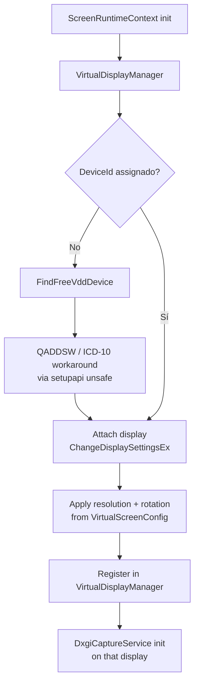

# Creación de Pantalla Virtual

Adjunta displays virtuales Parsec VDD al iniciar cada [[ScreenRuntimeContext]].

## Flujo

## P/Invoke unsafe

[[VirtualDisplayManager]] usa P/Invoke **unsafe** (`setupapi.dll`, `user32.dll`) — exige driver Parsec VDD instalado. Ver [[IDriverVerifier (Abstracción)]].

## Resolución

- Aplica `Width` × `Height` × `RefreshRate` desde [[VirtualScreenConfig (Campos)]].
- [[Perfiles de Resolución]] predefinidos o custom ([[Resoluciones Personalizadas VDD]]).
- `VirtualResolutionWatcher` detecta cambios hardware → actualiza `virtualscreen.display.json`.

## Límite

Máximo **2 pantallas** virtuales (configurado en `ApplicationLifecycleManager`).

## Enlaces

- [[VirtualDisplayManager]]
- [[ScreenRuntimeContext]]
- [[IDriverVerifier (Abstracción)]]
- [[Perfiles de Resolución]]
- [[Resoluciones Personalizadas VDD]]