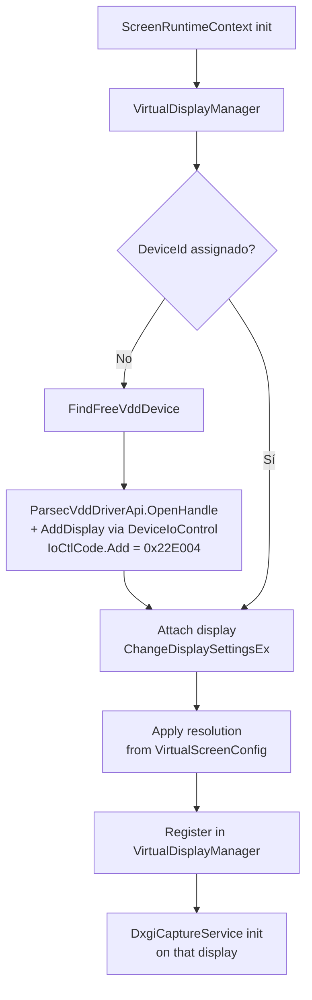

# Creación de Pantalla Virtual

Adjunta displays virtuales Parsec VDD al iniciar cada [[ScreenRuntimeContext]].

## Flujo

## P/Invoke unsafe

[[VirtualDisplayManager]] usa P/Invoke **unsafe** (`setupapi.dll`, `user32.dll`, `kernel32.dll`) a través de `ParsecVddDriverApi` — exige driver Parsec VDD instalado. La creación del display se hace con `DeviceIoControl` sobre el handle del driver (IoCtlCode `0x22E004`). Ver [[IDriverVerifier (Abstracción)]].

## Resolución

- Aplica `Width` × `Height` × `RefreshRate` desde [[VirtualScreenConfig (Campos)]].
- [[Perfiles de Resolución]] predefinidos o custom ([[Resoluciones Personalizadas VDD]]).
- `VirtualResolutionWatcher` detecta cambios hardware → actualiza `virtualscreen.display.json`.

## Límite

Máximo **2 pantallas** virtuales (definido por `VirtualWebDisplaySettings`: `Screen1` + `Screen2`).

## Enlaces

- [[VirtualDisplayManager]]
- [[ScreenRuntimeContext]]
- [[IDriverVerifier (Abstracción)]]
- [[Perfiles de Resolución]]
- [[Resoluciones Personalizadas VDD]]