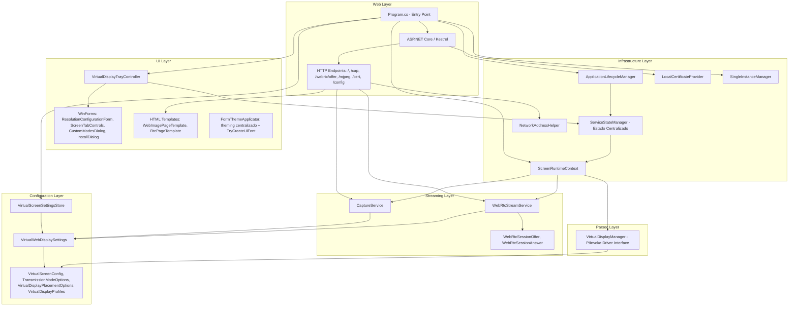
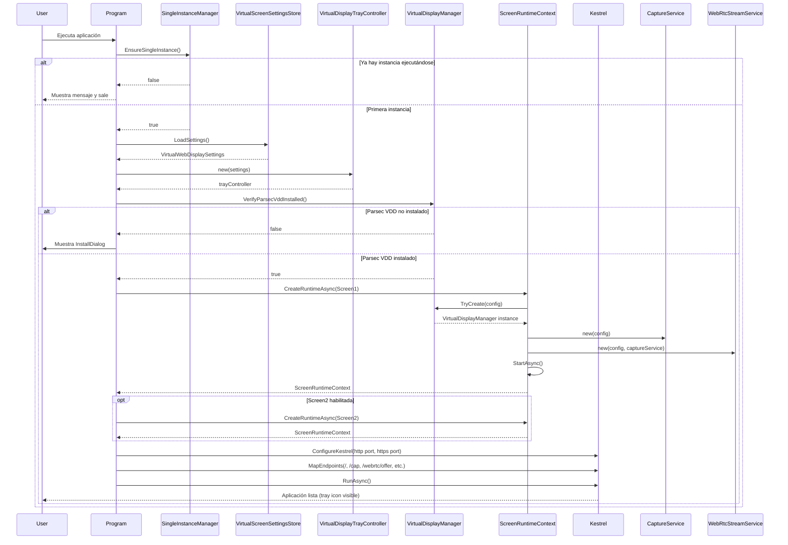
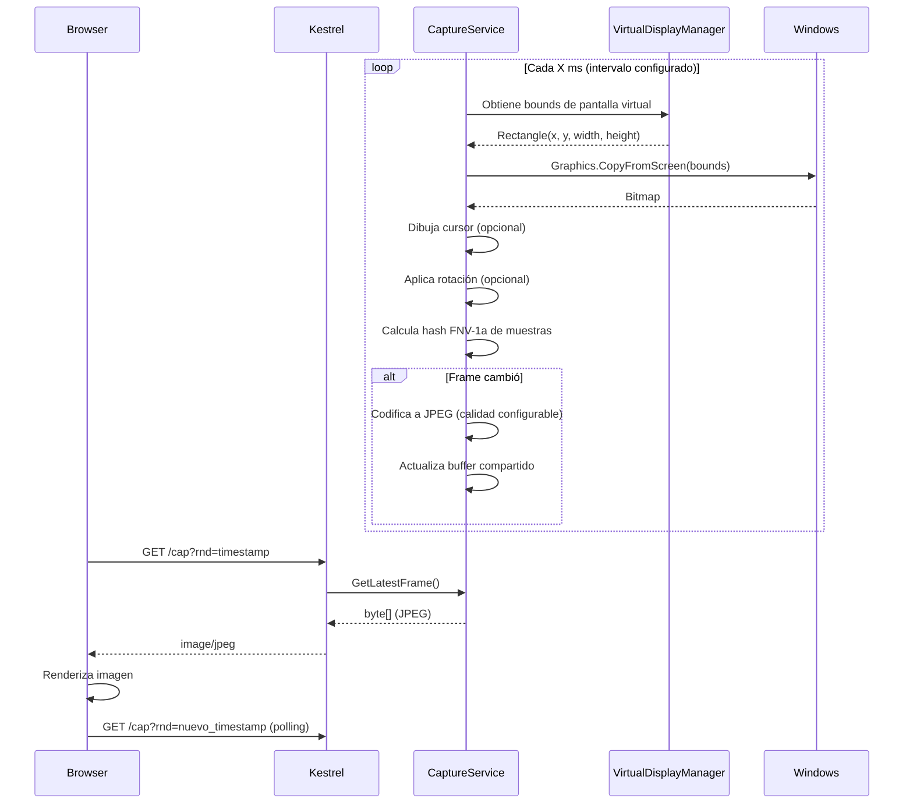
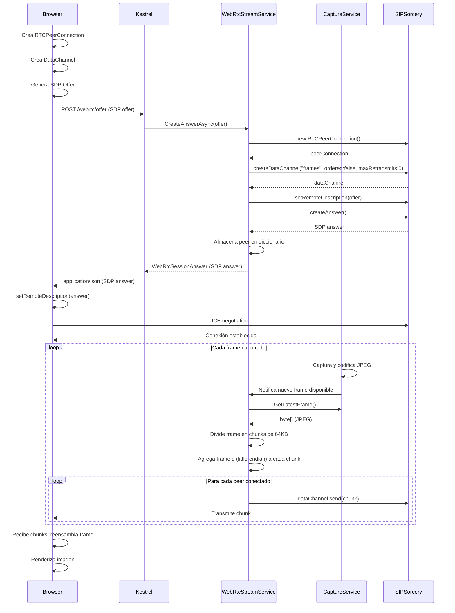
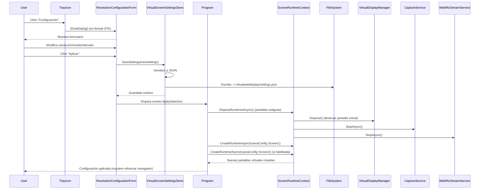

# 🏗️ Arquitectura de VirtualWebDisplay

## 📋 Tabla de Contenidos

1. [Visión General](#visión-general)
2. [Arquitectura de Capas](#arquitectura-de-capas)
3. [Diagramas del Sistema](#diagramas-del-sistema)
4. [Componentes Principales](#componentes-principales)
5. [Flujos de Datos](#flujos-de-datos)
6. [Decisiones de Diseño](#decisiones-de-diseño)
7. [Patrones Utilizados](#patrones-utilizados)

---

## Visión General

VirtualWebDisplay es una aplicación .NET 10 para Windows que crea pantallas virtuales y las transmite vía web usando JPEG polling o WebRTC. La arquitectura sigue un diseño por capas con separación clara de responsabilidades.

### Stack Tecnológico

- **.NET 10** (net10.0-windows)
- **ASP.NET Core / Kestrel** (servidor web)
- **WinForms** (interfaz de usuario)
- **SIPSorcery** (WebRTC)
- **Parsec VDD** (driver de pantalla virtual)
- **System.Drawing** (captura de pantalla)

---

## Arquitectura de Capas



### Responsabilidades por Capa

#### 1. **UI Layer** (`UI/`)
- **Propósito**: Interfaz gráfica del sistema (tray icon, formularios de configuración, templates web)
- **Componentes**:
  - `VirtualDisplayTrayController`: Gestiona el icono de la bandeja y el menú contextual
  - `ResolutionConfigurationForm`: Formulario principal de configuración. Bloquea controles mientras el servicio corre (`SetConfigurationControlsLocked`)
  - `ScreenTabControls`: Controles de tabs para configurar múltiples pantallas. `SetServiceRunning(bool)` deshabilita todos los controles excepto el botón de Windows Display mientras el servicio está activo
  - `CustomModesDialog`: Diálogo para editar los 5 slots de resolución personalizada del driver Parsec VDD. Incluye flujo UAC automático
  - `FormThemeApplicator`: Theming centralizado. `TryCreateUiFont()` centraliza la fuente UI. Soporta `Tag="preserve-color"` en paneles para preservar colores intencionales
  - `InstallDialog`: Diálogo de instalación del driver Parsec VDD
  - `IHtmlTemplate`: Interfaz base para generadores de HTML
  - `WebImagePageTemplate`: Generación HTML modo JPEG polling
  - `RtcPageTemplate`: Generación HTML modo WebRTC
- **Patrones**: STA Threading, Observer (eventos de formularios), Template Method (HTML generators)

#### 2. **Web Layer & Controllers** (Entry Point)
- **Propósito**: Servidor HTTP/HTTPS que expone la aplicación vía web, con helpers de acceso y autorización
- **Componentes**:
  - `Program.cs`: Punto de entrada, configuración de Kestrel, orquestación del ciclo de vida (~120 líneas)
  - `Controllers/WebApiEndpoints.cs`: Registro de todos los endpoints HTTP (`Map()` recibe el `WebApplication`)
  - `Controllers/SecurityLoginRequest.cs`: Modelo para deserialización POST /auth/login
  - `UI/HtmlTemplates/SecurityPageTemplate.cs`: Genera página HTML de login
  - `UI/HtmlTemplates/ViewerLimitPageTemplate.cs`: Genera página HTML cuando límite de viewers alcanzado
- **Endpoints**:
  - `GET /`: Página principal (template HTML según modo de transmisión)
  - `GET /cap`: Imagen JPEG actual (captura de pantalla)
  - `POST /auth/login`: Autenticación con código de 6 dígitos
  - `POST /webrtc/offer`: Negociación WebRTC (recibe offer, devuelve answer)
    - `POST /input/touch`: Entrada táctil remota
    - `GET /input/stats`: Métricas de touch/rate-limit
  - `GET /mjpeg`: Stream MJPEG continuo (solo modo JPEG)
  - `GET /cert`: Descarga certificado SSL autofirmado
  - `GET /config`: Descarga configuración JSON actual
- **Patrones**: MVC (minimal), Dependency Injection, Template Method (SecurityPageTemplate, ViewerLimitPageTemplate)

#### 3. **Configuration Layer** (`Configuration/`)
- **Propósito**: Gestión de configuración persistente y modelos de datos
- **Componentes**:
  - `VirtualWebDisplaySettings`: Configuración raíz (Screen1, Screen2)
    - `VirtualScreenSettingsStore`: Persistencia en JSON (~/.virtualwebdisplay/virtualscreen.user.json)
  - `VirtualScreenConfig`: Configuración individual de pantalla (resolución, posición, modo, etc.)
  - `TransmissionModeOptions`: Enum para modo de transmisión (WebImage, RTC)
  - `VirtualDisplayPlacementOptions`: Enum para posición de pantalla (Right, Left, Above, Below)
  - `VirtualDisplayProfiles`: Resoluciones predefinidas
- **Patrones**: Repository (VirtualScreenSettingsStore), Value Objects (enums)

#### 4. **Streaming Layer** (`Streaming/`)
- **Propósito**: Captura de pantalla y transmisión de video
- **Componentes**:
  - `CaptureService`: Servicio en segundo plano que captura pantalla y codifica a JPEG
  - `WebRtcStreamService`: Servicio WebRTC que gestiona conexiones de pares y transmite frames
  - `WebRtcSessionOffer`, `WebRtcSessionAnswer`: Modelos para negociación SDP
- **Optimizaciones**:
  - Detección de cambios en frames (hash FNV-1a de muestras)
  - Chunking de frames a 64KB para DataChannel
  - Caché de codecs JPEG
  - DataChannel configurado con `ordered: false`, `maxRetransmits: 0` para latencia mínima
- **Patrones**: Background Service, Observer (WebRTC events)

#### 5. **Parsec Layer** (`Parsec/`)
- **Propósito**: Interfaz con el driver de pantalla virtual Parsec VDD
- **Componentes**:
  - `VirtualDisplayManager`: Crea/destruye pantallas virtuales vía P/Invoke. URL de descarga del driver: `https://builds.parsec.app/vdd/parsec-vdd-0.45.0.0.exe`
  - `VddCustomModesStore`: Lee y escribe hasta 5 slots de resolución personalizada en `HKLM\SOFTWARE\Parsec\vdd\{0..4}` (requiere Admin para escribir)
- **Características**:
  - Código **unsafe** con llamadas Win32 API
  - Keep-alive loop (actualización cada 100ms) para mantener conexión con driver
  - Configuración de resolución, posición, frecuencia de actualización
- **Patrones**: Adapter (interfaz para driver externo), Disposable

#### 6. **Infrastructure Layer** (`Infrastructure/`)
- **Propósito**: Servicios transversales, utilidades y helpers de acceso
- **Componentes**:
  - ⭐ **`ServiceStateManager`**: Gestor centralizado del estado del servicio
    - **Estados**: `Stopped`, `Starting`, `Started`, `Stopping`
    - **Thread-safe**: Lock pattern para proteger acceso concurrente
    - **Eventos reactivos**: `StateChanged`, `ServiceStarted`, `ServiceStopped`
    - **Single Source of Truth**: Única fuente de verdad para el estado del servicio
    - **Métodos**: `RequestStart()`, `RequestStop()`, `CompleteStart()`, `CompleteStop()`
  - `ApplicationLifecycleManager`: Loop principal de arranque/parada del servicio
  - `ScreenRuntimeContext`: Contenedor que agrega DisplayManager + CaptureService + WebRtcStreamService
  - `NetworkAddressHelper`: Obtiene dirección IP local
  - `LocalCertificateProvider`: Genera/obtiene certificado SSL autofirmado
  - `SingleInstanceManager`: Previene múltiples instancias de la aplicación (mutex)
  - `RuntimeStartupHelper`: Inicializa runtimes (crea displays virtuales, asigna monitor index, arranca servicios)
  - `RuntimeAccessHelper`: Helpers estáticos para resolución runtime, autorización, cookies, normalización de config
  - `RuntimeCleanupHelper`: Helpers estáticos para disposal ordenado y waits de remoción de displays
- **Métodos Principales** (RuntimeAccessHelper):
  - `ResolveRuntime(HttpContext, IReadOnlyList<ScreenRuntimeContext>)`: Encuentra runtime por puerto local
  - `IsAuthorized(HttpContext, ScreenRuntimeContext)`: Verifica autorización del cliente
  - `SecurityCookieName(ScreenRuntimeContext)`: Genera nombre de cookie autofirmado
  - `ResolveViewerKey(HttpContext, ScreenRuntimeContext)`: Obtiene clave de viewer (cookie o IP)
  - `NormalizeBrowserImageFit(string?)`: Normaliza "fill"/"cover"/"contain"
- **Patrones**: State Machine (ServiceStateManager), Facade (ScreenRuntimeContext), Singleton (SingleInstanceManager), Static Helpers (RuntimeAccessHelper, RuntimeCleanupHelper)

---

## Diagramas del Sistema

### Flujo de Inicio de Aplicación



### Flujo de Captura y Streaming (Modo JPEG)



### Flujo de Streaming (Modo WebRTC)



### Flujo de Configuración



---

## Componentes Principales

### VirtualDisplayTrayController

**Namespace**: `VirtualWebDisplay.UI.TrayIcon`

**Responsabilidad**: Gestionar la interfaz de usuario de la bandeja del sistema.

**Características Clave**:
- Thread STA dedicado para WinForms
- Menú contextual dinámico (Configuración, Start/Stop, Salir)
- Gestión del ciclo de vida de `ResolutionConfigurationForm`
- Método `PostToUi` para operaciones thread-safe
- **Delegación de estado**: Usa `ServiceStateManager` para gestionar estado del servicio
- **Eventos reactivos**: Suscrito a `StateChanged`, `ServiceStarted`, `ServiceStopped`

**Dependencias**:
- `ServiceStateManager` (Infrastructure) - Estado del servicio
- `ConfigurationFormPresenter` (UI/TrayIcon) - Gestión de formularios
- `ResolutionConfigurationForm` (UI/Forms) - Formulario de configuración
- `VirtualWebDisplaySettings` (Configuration/Models) - Configuración

**Arquitectura refactorizada (2024)**:
- ✅ Eliminó 3 variables de estado duplicadas
- ✅ Delegó gestión de estado a `ServiceStateManager`
- ✅ Se enfoca solo en UI y coordinación

---

### ServiceStateManager ⭐

**Namespace**: `VirtualWebDisplay.Infrastructure`

**Responsabilidad**: Gestionar el estado del servicio de manera centralizada y thread-safe.

**Características Clave**:
- **Máquina de estados**: `Stopped`, `Starting`, `Started`, `Stopping`
- **Thread-safe**: Lock pattern (`_stateLock`) para proteger acceso concurrente
- **Eventos reactivos**: `StateChanged`, `ServiceStarted`, `ServiceStopped`
- **Single Source of Truth**: Única fuente de verdad para el estado del servicio
- **Transiciones validadas**: Solo permite transiciones válidas entre estados

**Métodos Públicos**:
```csharp
void RequestStart()                                    // Stopped → Starting
void RequestStop()                                     // Started → Stopping
void CompleteStart(IReadOnlyList<ScreenRuntimeContext>) // Stopped/Starting → Started
void CompleteStop()                                    // Cualquier estado → Stopped
Task<bool> WaitForStartRequestAsync()                  // Espera señal de reinicio
void SignalStartRequest()                              // Señala reinicio deseado
void SignalNoRestart()                                 // Señala salida
```

**Propiedades**:
```csharp
ServiceState CurrentState { get; }                     // Estado actual (thread-safe)
IReadOnlyList<ScreenRuntimeContext> ScreenRuntimes { get; } // Runtimes activos
bool IsStarted { get; }                                // CurrentState == Started
bool IsStopped { get; }                                // CurrentState == Stopped
bool IsTransitioning { get; }                          // Starting o Stopping
```

**Flujo de estados**:
```
Stopped → Starting → Started → Stopping → Stopped
    ↑                                         ↓
    └─────────────────────────────────────────┘
```

**Patrones aplicados**:
- State Machine Pattern
- Observer Pattern (eventos)
- Thread-safe Singleton (lock pattern)

---

### ConfigurationFormPresenter

**Namespace**: `VirtualWebDisplay.UI.TrayIcon`

**Responsabilidad**: Coordinar formularios de configuración y aplicar cambios thread-safe.

**Características Clave**:
- **Thread-safety**: `InvokeOnFormSafely()` para marshaling al UI thread
- **Suscripción reactiva**: Escucha eventos de `ServiceStateManager`
- **DRY**: Helper method elimina duplicación de código
- **Hot-reload**: Cambios táctiles sin reiniciar servicio

**Métodos Principales**:
```csharp
void OpenStartupForm(Action onConfirmed, Action onCancelled)
void ShowConfigurationDialog(IReadOnlyList<ScreenRuntimeContext>)
void InvokeOnFormSafely(Form?, Action<Form>)  // Thread-safe helper
```

**Arquitectura refactorizada (2024)**:
- ✅ Eliminó 32 líneas de código duplicado
- ✅ Thread-safety completo
- ✅ Métodos de notificación privados (mejor encapsulación)

---

### VirtualDisplayManager

**Namespace**: `VirtualWebDisplay.Parsec`

**Responsabilidad**: Interfaz con el driver Parsec VDD para crear/destruir pantallas virtuales.

**Características Clave**:
- Código **unsafe** con P/Invoke a Win32 APIs
- Keep-alive loop (actualización cada 100ms)
- Configuración de resolución, posición, frecuencia
- Disposable para cleanup automático

**APIs Críticas**:
- `CreateFile` (abrir handle al driver)
- `DeviceIoControl` (agregar/remover displays)
- `ChangeDisplaySettingsEx` (aplicar configuración)

**Advertencia**: Modificar este componente requiere conocimiento profundo de P/Invoke y gestión de recursos no administrados.

---

### CaptureService

**Namespace**: `VirtualWebDisplay.Streaming`

**Responsabilidad**: Captura de pantalla y codificación JPEG en segundo plano.

**Características Clave**:
- Hereda `BackgroundService` con loop continuo
- Detección de cambios (hash FNV-1a) para evitar codificaciones innecesarias
- Soporte para rotación de imagen (90°, 180°, 270°)
- Dibujo opcional de cursor
- Caché de `ImageCodecInfo` para performance

**Configuración**:
- Intervalo de captura: `CaptureIntervalMs` (default: 50ms = 20 FPS)
- Calidad JPEG: `JpegQuality` (default: 75, rango: 1-100)

**Optimizaciones**:
- Muestreo de píxeles para hash (no procesa imagen completa)
- Reutilización de buffer JPEG
- Codec cacheado para evitar búsquedas repetidas

---

### WebRtcStreamService

**Namespace**: `VirtualWebDisplay.Streaming`

**Responsabilidad**: Gestión de conexiones WebRTC y transmisión de frames.

**Características Clave**:
- Maneja múltiples peers concurrentes (diccionario thread-safe)
- DataChannel configurado para latencia mínima (`ordered: false`, `maxRetransmits: 0`)
- Chunking de frames a 64KB con prefijo `frameId` little-endian
- Negociación SDP (offer/answer)

**Flujo de Negociación**:
1. Browser envía SDP offer → `CreateAnswerAsync`
2. Servicio crea `RTCPeerConnection` + `DataChannel`
3. Servicio genera SDP answer → Browser
4. ICE negotiation automática vía SIPSorcery
5. Conexión establecida → comienza transmisión de frames

**Gestión de Peers**:
- Adición automática al recibir offer
- Remoción automática al detectar desconexión (`RTCPeerConnectionState.closed/failed`)

---

### ScreenRuntimeContext

**Namespace**: `VirtualWebDisplay.Infrastructure`

**Responsabilidad**: Contenedor agregando todos los servicios necesarios para una pantalla virtual.

**Componentes Gestionados**:
- `VirtualDisplayManager` (creación de pantalla virtual)
- `CaptureService` (captura de contenido)
- `WebRtcStreamService` (transmisión WebRTC)

**Ciclo de Vida**:
- `StartAsync()`: Inicia todos los servicios
- `StopAsync()`: Detiene servicios de forma ordenada
- `DisposeAsync()` / `Dispose()`: Libera recursos (elimina pantalla virtual)

**Uso**:
```csharp
var context = await ScreenRuntimeContext.CreateRuntimeAsync(screenConfig);
await context.StartAsync();
// ... uso ...
await context.DisposeAsync(); // Cleanup completo
```

---

### VirtualScreenSettingsStore

**Namespace**: `VirtualWebDisplay.Configuration`

**Responsabilidad**: Persistencia de configuración en JSON.

**Ubicación del Archivo**:
- Ruta: `~/.virtualwebdisplay/settings.json`
- Ejemplo: `C:\Users\Usuario\.virtualwebdisplay\settings.json`

**Métodos**:
- `LoadSettings()`: Carga desde JSON o devuelve configuración por defecto
- `SaveSettings(settings)`: Guarda en JSON con validación previa

**Validación**:
- Llama `settings.EnsureValid()` antes de guardar
- Detecta y resuelve conflictos de puertos
- Normaliza valores fuera de rango

---

## Flujos de Datos

### 1. Captura de Pantalla → JPEG

```
VirtualDisplayManager (bounds) → Windows API (CopyFromScreen) → Bitmap →
[Opcional: Dibujar cursor] → [Opcional: Rotar imagen] →
Hash FNV-1a (detección de cambios) → JPEG Encoder (calidad configurable) →
MemoryStream → byte[]
```

### 2. Transmisión JPEG (Web Image)

```
CaptureService (byte[] JPEG) → Almacena en campo compartido →
Browser (GET /cap) → Kestrel → CaptureService.GetLatestFrame() →
Response (image/jpeg) → Browser (actualiza capa visual de pantalla)
```

### 3. Transmisión WebRTC

```
CaptureService (byte[] JPEG) → WebRtcStreamService (chunking a 64KB) →
Agrega frameId little-endian → Itera peers conectados →
DataChannel.send(chunk) → SIPSorcery → Browser (RTCDataChannel.onmessage) →
Reensamblado de chunks → Blob → render de frame en cliente
```

### 4. Configuración de Usuario

```
User (modifica ResolutionConfigurationForm) → Evento ApplySelection →
VirtualScreenSettingsStore.SaveSettings() → JSON file (~/.virtualwebdisplay/virtualscreen.user.json) →
ApplicationLifecycleManager (dispose runtimes antiguos + crea nuevos) →
VirtualDisplayManager.TryCreate() → Parsec VDD (crea pantalla virtual) →
CaptureService + WebRtcStreamService (inician con nueva config)
```

---

## Decisiones de Diseño

### 1. **Separación por Capas (Layered Architecture)**

**Decisión**: Organizar código en 6 capas (UI, Web, Configuration, Streaming, Parsec, Infrastructure).

**Rationale**:
- **Mantenibilidad**: Cambios en una capa no afectan otras (bajo acoplamiento)
- **Testabilidad**: Cada capa puede ser probada independientemente
- **Claridad**: Responsabilidades bien definidas
- **Escalabilidad**: Fácil agregar nuevas características (ej: nuevo modo de transmisión)

**Trade-offs**:
- ✅ Código más organizado y navegable
- ✅ Reducción de complejidad (archivos de 850 líneas → 250 líneas)
- ❌ Mayor número de archivos (15 → 21 archivos en estructura organizada)

---

### 2. **Background Services para Captura/Streaming**

**Decisión**: `CaptureService` y `WebRtcStreamService` heredan `BackgroundService`.

**Rationale**:
- **Operación Continua**: Necesitan ejecutarse en segundo plano sin bloquear UI
- **Gestión de Ciclo de Vida**: .NET gestiona automáticamente inicio/parada con cancellation tokens
- **Integración con DI**: Pueden inyectarse como servicios hosteados

**Alternativas Consideradas**:
- ❌ Threads manuales: Mayor complejidad, propenso a errores (olvido de cleanup)
- ❌ Timers: No apropiado para loops continuos con lógica compleja

---

### 3. **Detección de Cambios en Frames (Hash FNV-1a)**

**Decisión**: Calcular hash de muestras de píxeles para detectar si frame cambió antes de codificar JPEG.

**Rationale**:
- **Performance**: Evita codificaciones JPEG innecesarias cuando pantalla está estática
- **CPU Efficiency**: Hash de muestras es ~100x más rápido que codificación JPEG completa
- **Reducción de Ancho de Banda**: No transmite frames duplicados

**Implementación**:
- Muestrea ~1% de píxeles distribuidos uniformemente
- Hash FNV-1a (rápido, baja colisión para este caso de uso)
- Solo codifica si hash difiere del frame anterior

**Trade-offs**:
- ✅ Reducción drástica de CPU cuando pantalla estática
- ✅ Menor tráfico de red
- ❌ Overhead adicional de ~2-3ms por frame (aceptable)

---

### 4. **WebRTC DataChannel con `ordered: false`, `maxRetransmits: 0`**

**Decisión**: Configurar DataChannel para no ordenar paquetes ni retransmitir.

**Rationale**:
- **Latencia Mínima**: Prioridad en aplicaciones de pantalla remota
- **Frames Independientes**: Cada frame JPEG es completo, no depende de frames anteriores
- **Tolerancia a Pérdida**: Preferible mostrar frame más reciente con glitches que frame antiguo perfecto

**Comportamiento**:
- Si paquete se pierde → no retransmite (evita retraso)
- Si paquetes llegan desordenados → entrega inmediatamente (no espera ordenamiento)
- Resultado: Frame puede tener artefactos visuales leves pero latencia ultra-baja

**Alternativas**:
- ❌ `ordered: true, maxRetransmits: 3`: Mayor latencia (~100-200ms adicionales)
- ❌ Video codec (H.264): Complejidad mayor, dependencia de frames previos

---

### 5. **Chunking de Frames a 64KB**

**Decisión**: Dividir frames JPEG en chunks de 64KB máximo antes de enviar por DataChannel.

**Rationale**:
- **Límite de WebRTC**: DataChannel tiene límite de tamaño de mensaje (~256KB según implementación)
- **Eficiencia de Red**: Chunks más pequeños fluyen mejor en redes con alta latencia
- **Reensamblado Simple**: Prefijo `frameId` de 4 bytes permite reensamblar correctamente

**Implementación**:
```
Frame original: 250KB JPEG
↓
Chunk 1: [frameId: 00 00 00 01][primeros 64KB]
Chunk 2: [frameId: 00 00 00 01][siguientes 64KB]
Chunk 3: [frameId: 00 00 00 01][siguientes 64KB]
Chunk 4: [frameId: 00 00 00 01][restantes ~58KB]
```

Browser reensambla chunks con mismo `frameId` → Blob → `createObjectURL` → ``

---

### 6. **Templates HTML vs. Embedded Strings**

**Decisión**: Extraer HTML a clases template (`IHtmlTemplate`, `WebImagePageTemplate`, `RtcPageTemplate`).

**Rationale**:
- **Separación de Concerns**: Lógica de presentación fuera de Program.cs
- **Mantenibilidad**: Cambios de UI no requieren modificar código de servidor
- **Testabilidad**: Templates pueden ser probados independientemente
- **Extensibilidad**: Fácil agregar nuevos templates (ej: modo H.264 futuro)

**Antes**:
```csharp
var html = @"<!DOCTYPE html><html>..."; // 228 líneas en Program.cs
```

**Después**:
```csharp
var template = transmissionMode == RTC 
    ? new RtcPageTemplate() 
    : new WebImagePageTemplate();
var html = template.Generate(config, addresses, port);
```

---

### 7. **Carpeta Oculta `.virtualwebdisplay` en Perfil de Usuario**

**Decisión**: Almacenar `virtualscreen.user.json` en `~/.virtualwebdisplay/`.

**Rationale**:
- **Convención de Usuario**: Similar a `.ssh`, `.docker`, `.config`
- **Persistencia entre Actualizaciones**: Configuración sobrevive reinstalaciones
- **Múltiples Usuarios**: Cada usuario Windows tiene su propia configuración
- **No Requiere Permisos Elevados**: Escribir en `%USERPROFILE%` no requiere admin

**Ubicación**:
```
C:\Users\<Usuario>\.virtualwebdisplay\
    virtualscreen.user.json
```

---

### 8. **Single Instance con Mutex Global**

**Decisión**: Prevenir múltiples instancias usando mutex global nombrado.

**Rationale**:
- **Conflictos de Puerto**: Dos instancias intentarían usar mismo puerto HTTP
- **Conflictos de Pantalla Virtual**: Parsec VDD no soporta múltiples controladores simultáneos
- **Experiencia de Usuario**: Evita confusión con múltiples tray icons

**Implementación**:
- Mutex global: `Global\VirtualWebDisplay_SingleInstance`
- `WaitOne(0)`: Intenta adquirir sin esperar
- Si falla → muestra mensaje → sale

---

### 9. **Certificado SSL Autofirmado con SAN**

**Decisión**: Generar certificado SSL con Subject Alternative Names incluyendo IPs locales.

**Rationale**:
- **Requisito de WebRTC**: Navegadores modernos requieren HTTPS para getUserMedia y WebRTC (excepto localhost)
- **Acceso Remoto**: Clientes en red local acceden vía IP (ej: `https://192.168.1.100:5001`)
- **SAN Necesario**: Chrome/Edge rechazan certificados sin SAN que coincida con URL

**Generación**:
- Certificado RSA 2048 bits
- SANs: `localhost`, IP local, `127.0.0.1`
- Validez: 10 años
- Almacenado en: `~/.virtualwebdisplay/localhost.pfx`

**Instalación Manual**:
- Usuario puede descargar `/cert` e instalar en "Autoridades de certificación raíz de confianza"
- Elimina advertencias de seguridad en navegador

---

## Patrones Utilizados

### 1. **Repository Pattern**
- **Clase**: `VirtualScreenSettingsStore`
- **Propósito**: Abstrae persistencia de configuración (JSON)
- **Beneficio**: Fácil cambiar a otra fuente (ej: base de datos, registro)

### 2. **Template Method Pattern**
- **Interface**: `IHtmlTemplate`
- **Implementaciones**: `WebImagePageTemplate`, `RtcPageTemplate`
- **Propósito**: Generar HTML variante según modo de transmisión
- **Beneficio**: Extensible para nuevos modos (ej: H.264)

### 3. **Facade Pattern**
- **Clase**: `ScreenRuntimeContext`
- **Propósito**: Simplifica interacción con `VirtualDisplayManager + CaptureService + WebRtcStreamService`
- **Beneficio**: Cliente (`ApplicationLifecycleManager`) no necesita gestionar componentes individuales

### 4. **Singleton Pattern**
- **Clase**: `SingleInstanceManager`
- **Propósito**: Asegurar una sola instancia de aplicación
- **Implementación**: Mutex global nombrado

### 5. **Adapter Pattern**
- **Clase**: `VirtualDisplayManager`
- **Propósito**: Adapta API de Parsec VDD (Win32) a objetos .NET manejables
- **Beneficio**: Aísla código unsafe/P/Invoke del resto de aplicación

### 6. **Observer Pattern**
- **Uso**: Eventos de WinForms (`ApplySelection`, click de menú)
- **Propósito**: Desacoplar UI de lógica de negocio
- **Beneficio**: `ResolutionConfigurationForm` no conoce detalles de bootstrap/ciclo HTTP

### 7. **Dependency Injection**
- **Uso**: Servicios hosteados en `Program.cs`
- **Componentes**: `CaptureService`, `WebRtcStreamService` inyectados en `ScreenRuntimeContext`
- **Beneficio**: Facilita testing con mocks

### 8. **Disposable Pattern**
- **Clases**: `VirtualDisplayManager`, `ScreenRuntimeContext`, `VirtualDisplayTrayController`
- **Propósito**: Gestión determinística de recursos (handles, bitmaps, mutex)
- **Implementación**: `IDisposable` / `IAsyncDisposable`

---

## Extensibilidad

### Agregar Nuevo Modo de Transmisión

1. **Crear Template HTML**:
   ```csharp
   // UI/HtmlTemplates/H264PageTemplate.cs
   public class H264PageTemplate : IHtmlTemplate
   {
       public string Generate(VirtualScreenConfig config, string[] addresses, int port)
       {
           // HTML con <video> usando MediaSource Extensions
       }
   }
   ```

2. **Actualizar Enum**:
   ```csharp
   // Configuration/TransmissionModeOptions.cs
   public enum TransmissionModeOptions
   {
       WebImage,
       RTC,
       H264 // <-- Nuevo
   }
   ```

3. **Crear Servicio de Streaming**:
   ```csharp
   // Streaming/H264StreamService.cs
   public class H264StreamService : BackgroundService
   {
       // Codifica frames a H.264, envía vía WebRTC o WebSocket
   }
   ```

4. **Integrar en templates/handler**:
   ```csharp
   var template = config.TransmissionMethod switch
   {
       Rtc => new RtcPageTemplate(),
       H264 => new H264PageTemplate(),
       _ => new WebImagePageTemplate()
   };
   ```

### Agregar Tercera Pantalla Virtual

1. **Actualizar Modelo**:
   ```csharp
   // Configuration/Models/VirtualWebDisplaySettings.cs
   public record VirtualWebDisplaySettings
   {
       public VirtualScreenConfig Screen1 { get; init; }
       public VirtualScreenConfig Screen2 { get; init; }
       public VirtualScreenConfig Screen3 { get; init; } // <-- Nuevo
   }
   ```

2. **Actualizar UI**:
   - Agregar tab "Screen 3" en `ScreenTabControls`
   - Actualizar `ResolutionConfigurationForm` para gestionar 3 tabs

3. **Actualizar Lógica de Creación**:
   ```csharp
   // RuntimeFactory.cs
   if (settings.Screen3.Enabled)
   {
       var runtime3 = CreateRuntime(settings.Screen3);
       runtimes.Add(runtime3);
   }
   ```

---

## Notas Finales

Esta arquitectura prioriza:
- ✅ **Separación de responsabilidades** (Single Responsibility Principle)
- ✅ **Bajo acoplamiento** (cada capa independiente)
- ✅ **Alta cohesión** (componentes relacionados agrupados)
- ✅ **Extensibilidad** (fácil agregar pantallas/modos)
- ✅ **Mantenibilidad** (código organizado, navegable)
- ✅ **Performance** (optimizaciones en captura/streaming)

Para modificaciones, consultar **AGENT.md** para reglas detalladas y áreas sensibles.
